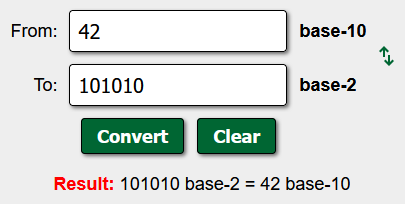

# 🔮 Challenge: 2warm
**Category:** General Skills | **Difficulty:** Easy | **Author:** Sanjay C/Danny Tunitis

## 📝 Challenge Description
*"Can you convert the number 42 (base 10) to binary (base 2)?"*

This challenge is a direct follow-up to previous "Warm Up" tasks, focusing on the most fundamental numbering system in computing: **Binary (Base 2)**.

---

## 🔍 Analysis
In computing, all data is ultimately represented as binary. While we use Decimal (Base 10) in our daily lives, computers use bistable states (0 and 1). 

The goal is a simple mathematical conversion:
* **Decimal (Base 10):** Uses digits 0-9.
* **Binary (Base 2):** Uses only digits 0 and 1.

The number **42** is a famous reference in geek culture (The Hitchhiker's Guide to the Galaxy), making it a perfect candidate for this "warm-up" exercise.

---

## 🛠️ Solution

### Step 1: Conversion
I utilized a standard base converter to translate the decimal value. Entering `42` as the input (Base 10) and selecting Binary (Base 2) as the target yielded the result: `101010`.

  
  
<i>Figure 1: Converting the decimal number 42 to its binary representation 101010.</i>

### Step 2: Flag Formatting
Wrapping the binary result in the required picoCTF format:

**Flag:** `picoCTF{101010}`

---

## 🚩 Final Flag

  
Click to reveal the flag

  
  `picoCTF{101010}`

---

## 💡 Key Takeaways
* **Binary Fundamentals:** Understanding that each position in a binary number represents a power of 2 (32 + 8 + 2 = 42).
* **Efficiency:** Knowing when to use quick conversion tools to maintain momentum during a CTF.
