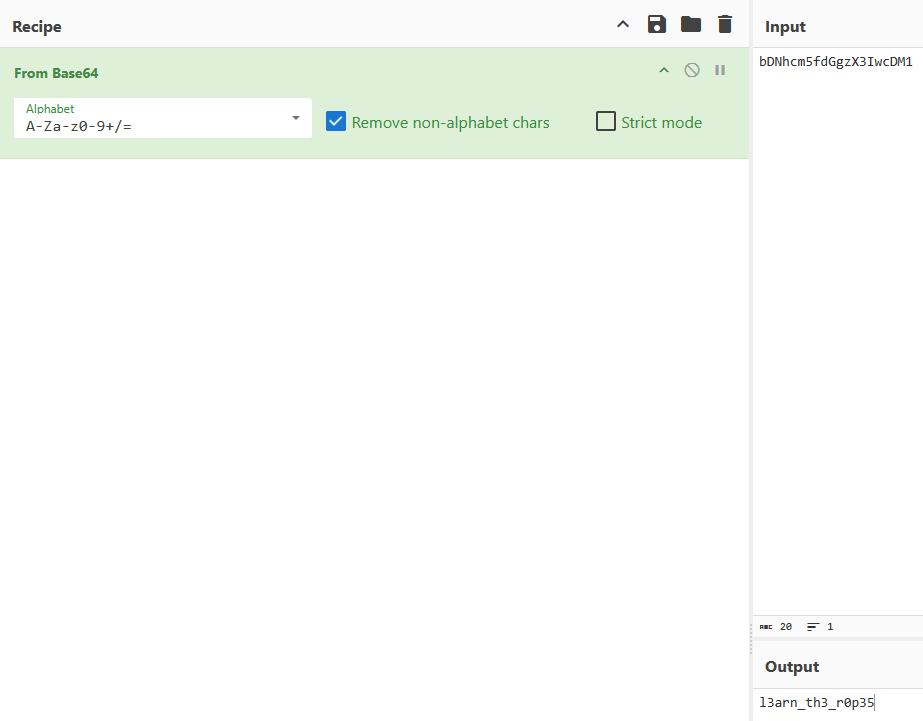

# 🔮 Challenge: Bases
**Category:** General Skills | **Difficulty:** Easy | **Author:** Sanjay C/Danny T

## 📝 Challenge Description
*"What does this bDNhcm5fdGgzX3IwcDM1 mean? I think it has something to do with bases."*

This challenge focuses on identifying and decoding common data encoding schemes used in web and network communications—specifically Base64.

---

## 🔍 Analysis
The string `bDNhcm5fdGgzX3IwcDM1` has the distinct characteristics of **Base64** encoding:
* It uses a mix of uppercase (`A-Z`) and lowercase (`a-z`) letters.
* It includes numbers (`0-9`).
* The length and character set are consistent with the Base64 alphabet.

Base64 is not encryption, but an encoding scheme used to represent binary data in an ASCII string format.

---

## 🛠️ Solution

### Step 1: Decoding with CyberChef
To decode the string, I used **CyberChef**, a powerful web-based tool for data manipulation. 
1. I pasted the encoded string into the **Input** field.
2. I applied the **"From Base64"** recipe.
3. The output instantly revealed the plaintext: `l3arn_th3_r0p35`.

  
  
<i>Figure 1: Using CyberChef to decode the Base64 string into readable text.</i>

### Step 2: Flag Formatting
I then wrapped the decoded string into the required picoCTF flag format.

**Flag:** `picoCTF{l3arn_th3_r0p35}`

---

## 🚩 Final Flag

  
Click to reveal the flag

  
  `picoCTF{l3arn_th3_r0p35}`

---

## 💡 Key Takeaways
* **Encoding Identification:** Recognizing Base64 by its character set is a fundamental skill in CTFs.
* **CyberChef Mastery:** Leveraging tools like CyberChef saves time and reduces errors compared to manual decoding or writing custom scripts for simple tasks.
