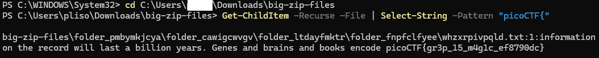

# Challenge: Big Zip
**Category:** General Skills | **Difficulty:** Easy | **Author:** LT 'syreal' Jones

## Challenge Description
"Unzip this archive and find the flag."

This challenge simulates a common scenario in digital forensics and system administration: locating a specific piece of information buried deep within a massive directory structure containing thousands of irrelevant files.

## Analysis
The provided file is a .zip archive. Upon extraction, it reveals a deeply nested folder structure filled with dummy data (text files, logs, etc.). Manually opening and inspecting each folder and file is practically impossible and highly inefficient.

The goal is to automate the search process to scan the contents of every single file within the extracted directory tree for the known flag format: picoCTF{.

## Solution

### Step 1: Extract the Archive
First, the archive was extracted using standard OS extraction utilities, resulting in a large directory named big-zip-files containing the nested folders.

### Step 2: Recursive String Search (PowerShell)
To find the hidden flag efficiently under a Windows environment, I utilized PowerShell's built-in cmdlets to perform a recursive string search through all files in the directory.

Navigating to the extracted folder, I executed the following command:

```powershell
Get-ChildItem -Recurse -File | Select-String -Pattern "picoCTF{"
```

* `Get-ChildItem -Recurse -File`: Recursively lists all files within the current directory and all of its subdirectories.
* `|` (Pipe): Passes the output (the list of files) directly to the next command.
* `Select-String -Pattern "picoCTF{"`: Reads the content of each file and searches for the specified string pattern.


*Figure 1: PowerShell terminal output showing the exact file path and the line containing the hidden flag.*

*(Note: In a Unix/Linux environment, the exact same result can be achieved using `grep -R "picoCTF{" .`)*

## Final Flag
<details>
  <summary>Click to reveal the flag</summary>

  `picoCTF{gr3p_15_m4g1c_ef8790dc}`
</details>

## Key Takeaways
* **Data Mining:** Automating recursive searches is an essential skill for parsing through large datasets, log dumps, or source code repositories.
* **Environment Adaptability:** Understanding how to perform equivalent operations across different operating systems (e.g., Select-String in PowerShell vs. grep in Linux) demonstrates versatile command-line proficiency.
