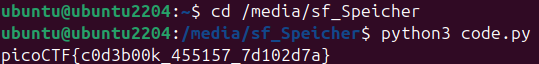

# 🚩 Challenge: Codebook
**Category:** General Skills | **Difficulty:** Easy | **Author:** LT 'syreal' Jones

## 📝 Challenge Description
"Run the Python script code.py in the same directory as codebook.txt."

This challenge emphasizes the importance of the Current Working Directory (CWD) when executing scripts that depend on external local files.

## 🔍 Analysis & Solution
We are provided with two files: a Python script (`code.py`) and a text file (`codebook.txt`). 

Based on the description, the Python script is programmed to open and read `codebook.txt` to decode or generate the flag. If the script is executed from a directory where `codebook.txt` is not present, it will throw a `FileNotFoundError`.

### Execution Step
To solve this, I simply ensured both downloaded files were placed inside the same directory. I opened my Linux terminal, navigated to that specific folder, and executed the script using the Python 3 interpreter:

```bash
python3 code.py
```

Because both files were in the same directory, the script successfully located the text file, processed the data, and printed the flag.



*Figure 1: Executing code.py successfully because codebook.txt is present in the same directory.*

## 🚩 Final Flag
<details>
  <summary>Click to reveal the flag</summary>

  `picoCTF{c0d3b00k_455157_7d102d7a}`
</details>

## 💡 Key Takeaways
* **Working Directory:** When a script reads a file using a relative path (like just the filename), the OS looks for that file in the directory from which the script was executed, not necessarily where the script itself is stored.
* **File Dependencies:** Understanding that scripts often rely on external configuration or data files to function properly.
