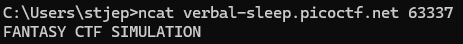
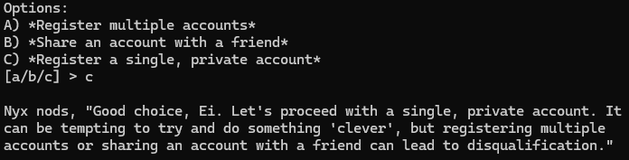
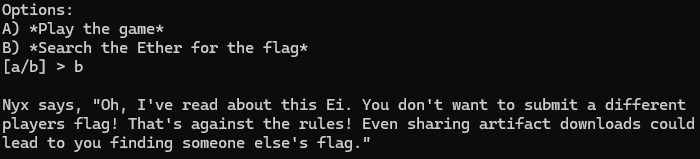
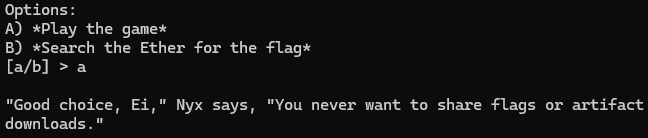
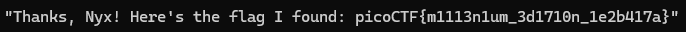

# Challenge: FANTASY CTF
**Category:** General Skills | **Difficulty:** Easy | **Author:** syreal

## 📝 Challenge Description
Play this short game to get familiar with terminal applications and some of the most important rules in scope for picoCTF. Additional details will be available after launching your challenge instance.

---

## 🔍 Analysis

The challenge description asks us to connect to a remote server using a terminal application. This is a common requirement in CTFs to interact with services, access remote shells, or, as in this case, play a text-based game.

### Initial Setup
To connect, we need a netcat client. While the classic `nc` or `netcat` tools are common, I opted to install `nmap`, which includes the modern and versatile `ncat` utility.

The challenge provided the connection string, which I executed in my terminal:

```bash
ncat verbal-sleep.picoctf.net 63337
```

<div align="center">
  
  <p><i>Figure 1: Establishing the connection using 'ncat' and receiving the game's introduction.</i></p>
</div>

---

## 🛠️ Solution

Upon connecting, the game presented a story and eventually a list of options regarding account registration.

### The Critical Choice

We are presented with three scenarios:
* A) Register multiple accounts (Simulation of a rule violation).
* B) Share an account with a friend (Simulation of a rule violation).
* C) Register a single, private account (The standard, rule-compliant action).

<div align="center">
  
  <p><i>Figure 2: The simulation asks us to choose an account registration method.</i></p>
</div>

I selected option **C** (`[a/b/c] > c`).

**Reasoning:** In CTF competitions, fairness is paramount. Standard rules strictly prohibit sharing accounts or creating multiple accounts to gain an unfair advantage (e.g., bypassing rate limits, colliding on flags, or manipulating leaderboards). Choosing option 'C' demonstrates understanding of and adherence to standard CTF Rules of Engagement. Nyx, the game character, confirms this was the 'Good choice' and notes that violations lead to disqualification.

### Navigating the Ethos

The simulation continued to test our understanding of CTF ethics. We were given options to either *Play the game* or *Search the Ether for the flag*.

<div align="center">
  
  <p><i>Figure 3: Exploring the temptation to 'search the Ether' for an easy flag.</i></p>
</div>

Initially selecting 'b' resulted in Nyx warning against submitting other players' flags or sharing artifact downloads, which is another form of rule-breaking. To proceed correctly, I selected option **A** (`[a/b] > a`), committing to *Play the game*.

<div align="center">
  
  <p><i>Figure 4: Confirming the choice to play the game fairly and find our own flag.</i></p>
</div>

By simply following the compliant, ethical path and continuing to play the simulation, we reached the end of the scenario.

---

## 🚩 Final Flag

After making the correct, ethical choices, the simulation concluded, and the flag was presented.

<div align="center">
  
  <p><i>Figure 5: The culmination of the 'FANTASY CTF' simulation, revealing the flag.</i></p>
</div>

<details>
  <summary>Click to reveal the flag</summary>
  
  `picoCTF{m1113n1um_3d1710n_1e2b417a}`
</details>

---

## 💡 What I learned
* **CLI Networking:** Using `ncat` (from the `nmap` suite) to connect to remote TCP services.
* **CTF Ethics:** Reinforced core Rules of Engagement: single accounts only, no flag sharing, and solving challenges independently.
* **Orientation:** An introduction to the interactive format common in many general-skills CTF challenges.
