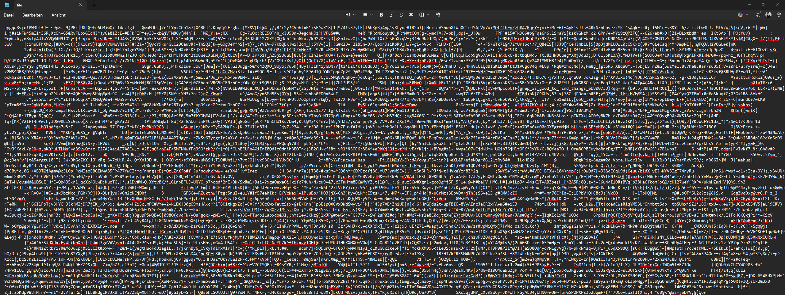
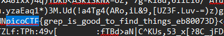
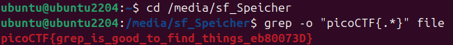

# Challenge: First Grep
**Category:** General Skills | **Difficulty:** Easy | **Author:** Alex Fulton/Danny Tunitis

## Challenge Description
*"Can you find the flag in the file? This would be really tedious to look through manually, something tells me there is a better way."*

This challenge is designed to demonstrate the inefficiency of manual inspection versus the power of automated pattern searching in large datasets.

---

## Analysis
Upon opening the provided file, it becomes immediately clear why manual searching is not recommended. The file contains a massive, disorganized block of text, making it nearly impossible for a human to spot the flag among the noise.

<div align="center">
  
  <p><i>Figure 1: The raw file content is a massive wall of text, illustrating the need for automated tools.</i></p>
</div>

While a standard text editor's search function (`Ctrl+F`) can find the flag, the goal of this challenge is to utilize Linux-native command-line utilities for more robust data processing.

<div align="center">
  
  <p><i>Figure 2: Successfully finding the flag via a text editor search.</i></p>
</div>

---

## Solution: The Power of Grep

To solve this the "intended" way, I used the **`grep`** utility in my Ubuntu environment. `grep` is a command-line tool for searching plain-text data sets for lines that match a regular expression.

Instead of just searching for the string, I used the **`-o`** (only-matching) flag to isolate the flag from the surrounding garbage data.

```bash
grep -o "picoCTF{.*}" file
```

* **`grep`**: The search command.
* **`-o`**: Tells grep to print only the matching part of the line, not the whole line.
* **`"picoCTF{.*}"`**: The search pattern. The `.*` acts as a wildcard for any characters inside the brackets.

<div align="center">
  
  <p><i>Figure 3: Using grep -o in the terminal to instantly extract the flag.</i></p>
</div>

---

## 🚩 Final Flag
<details>
  <summary>Click to reveal the flag</summary>
  
  `picoCTF{grep_is_good_to_find_things_eb80073D}`
</details>

---

## Key Takeaways
* **Automation over Manual Labor:** Never search through large files manually if a tool like `grep` is available.
* **Grep Flags:** Understanding the `-o` flag is essential for exfiltrating specific data strings like flags or passwords from messy log files.
* **Regex Basics:** Using `.*` as a simple wildcard is the first step toward mastering regular expressions.
