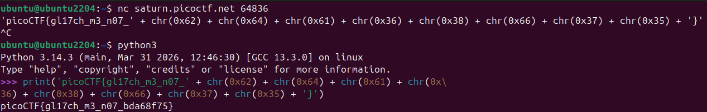

# 🚩 Challenge: Glitch Cat
**Category:** General Skills | **Difficulty:** Easy | **Author:** LT 'syreal' Jones

## 📝 Challenge Description
"Our flag printing service has started glitching! `$ nc saturn.picoctf.net 64836`"

This challenge introduces interacting with network services using `netcat` (`nc`) and handling data formats that might not be immediately readable, requiring basic script execution to parse the output.

## 🔍 Analysis & Solution
The description instructs us to connect to a remote server via TCP using the `nc` command.

### Step 1: Connecting to the Server
I opened my Linux terminal and connected to the provided address and port:

```bash
nc saturn.picoctf.net 64836
```

*(Note: picoCTF uses dynamic instances for this challenge. The port number `64836` was specific to my session and will be different for you. Make sure to launch your own instance on the platform and use the provided port.)*

Instead of a clean flag, the server responded with a string that looked like a mix of plain text and Python code:
`'picoCTF{gl17ch_m3_n07_' + chr(0x62) + chr(0x64) + chr(0x61) + chr(0x36) + chr(0x38) + chr(0x66) + chr(0x37) + chr(0x35) + '}'`

### Step 2: Decoding the Glitched Output
The output is actually a valid Python expression. The `chr()` function in Python converts an ASCII integer (in this case, written in hexadecimal format like `0x62`) into its corresponding character. 

Instead of translating the hex values (`0x62`, `0x64`, etc.) manually via an ASCII table, I used the Python interpreter directly in the terminal to evaluate the expression.

Python automatically concatenated the strings and decoded the hex values, revealing the final, clean flag.



*Figure 1: Connecting via netcat and using the interactive Python console to decode the glitched flag string.*

## 🚩 Final Flag
<details>
  <summary>Click to reveal the flag</summary>

  `picoCTF{gl17ch_m3_n07_bda68f75}`
</details>

## 💡 Key Takeaways
* **Netcat (`nc`):** The "Swiss Army knife" of networking, used here to connect to raw TCP sockets.
* **Code as Output:** Sometimes servers output executable code or data structures instead of plain text. Recognizing the syntax (in this case, Python's `chr()` function) allows for quick and automated decoding.
* **Dynamic Instances:** Understanding that infrastructure in modern CTFs is often spawned on-demand and is ephemeral.
