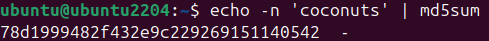
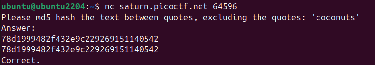
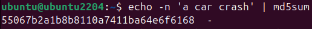
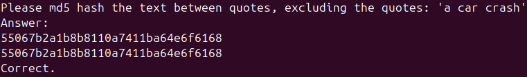
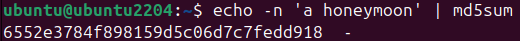
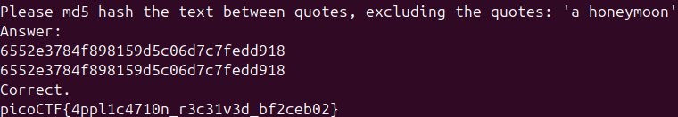

# 🚩 Challenge: HashingJobApp
**Category:** General Skills | **Difficulty:** Easy | **Author:** LT 'syreal' Jones

## 📝 Challenge Description
"If you want to hash with the best, beat this test! `nc saturn.picoctf.net 64596`"

This challenge requires the user to connect to a remote service, read dynamically generated strings, hash them using MD5, and submit the hashes back to the server within a specific time limit.

## 🔍 Analysis & Solution
Connecting to the server via `netcat` reveals an interactive prompt asking for the MD5 hash of a specific string.

There are two key constraints to understand here:
1. The remote server expects the raw 32-character MD5 hash string as input, not a terminal command.
2. The strings are dynamically generated per session and must be answered consecutively. Disconnecting or taking too long will reset the state.

### Execution Step
To solve this efficiently without writing an automated script, I utilized a dual-terminal approach to quickly calculate and submit the hashes before the session timed out.

*(Note: picoCTF uses dynamic instances for this challenge. The port number `64596` was specific to my session.)*

Here is the exact step-by-step walkthrough using the dual-terminal method to beat the 3 consecutive prompts:

#### Round 1: 'coconuts'
After connecting in Terminal 1, the server asked for the hash of `'coconuts'`. In Terminal 2, I used the `echo -n` command (the `-n` flag is critical to prevent appending a hidden newline character, which would corrupt the hash):

```bash
echo -n 'coconuts' | md5sum
```

*Figure 1: Calculating the MD5 hash for 'coconuts' in Terminal 2.*

I copied the resulting hash and submitted it in Terminal 1, successfully passing the first check.


*Figure 2: Submitting the first hash.*

#### Round 2: 'a car crash'
The server immediately prompted for the next string: `'a car crash'`. I repeated the process in Terminal 2:

```bash
echo -n 'a car crash' | md5sum
```

*Figure 3: Calculating the MD5 hash for 'a car crash'.*

I pasted this second hash into Terminal 1 to pass the second check.


*Figure 4: Submitting the second hash.*

#### Round 3: 'a honeymoon'
The final prompt asked for the hash of `'a honeymoon'`. One last calculation in Terminal 2:

```bash
echo -n 'a honeymoon' | md5sum
```

*Figure 5: Calculating the final MD5 hash for 'a honeymoon'.*

Submitting this third and final hash successfully beat the test, and the server revealed the flag.


*Figure 6: Submitting the final hash and receiving the flag.*

## 🚩 Final Flag
<details>
  <summary>Click to reveal the flag</summary>

  `picoCTF{4ppl1c4710n_r3c31v3d_bf2ceb02}`
</details>

## 💡 Key Takeaways
* **Session State:** Understanding that network challenges often generate dynamic content per connection.
* **CLI Nuances:** The `echo -n` flag is a vital tool. Overlooking hidden characters like trailing newlines is a common source of error when generating hashes.
* **CLI Efficiency:** Using multiple terminal windows for concurrent operations is a fundamental workflow in CTF environments.
