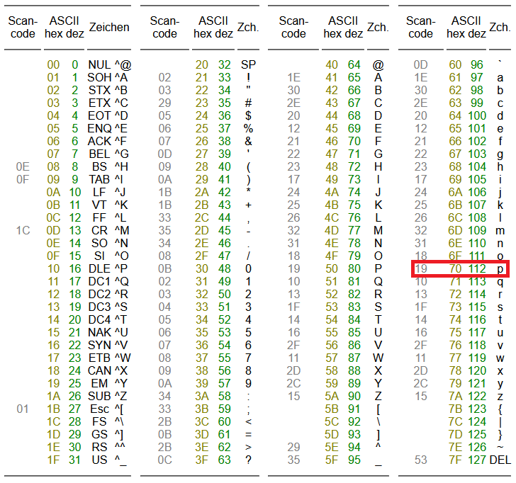
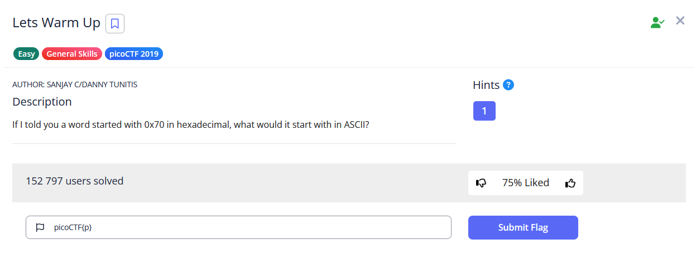

# 🔮 Challenge: Lets Warm Up
**Category:** General Skills | **Difficulty:** Easy | **Author:** Sanjay C/Danny Tunitis

## 📝 Challenge Description
*"If I told you a word started with 0x70 in hexadecimal, what would it start with in ASCII?"*

This is a classic beginner-level CTF challenge designed to introduce fundamental data encoding concepts, specifically the conversion between Hexadecimal values and ASCII characters.

---

## 🔍 Analysis & Strategy
Sometimes the best strategy in a CTF is to realize that a challenge is exactly as simple as it looks. There are no tricks here, no reverse engineering, and no hidden payloads. 

The prompt provides a raw hexadecimal value (`0x70`) and asks for its ASCII equivalent. The most straightforward and reliable way to solve this is to consult a standard ASCII table.

---

## 🛠️ Solution

### Step 1: Using an ASCII Table
I opened a standard ASCII reference chart to look up the hexadecimal value `70` (the `0x` prefix simply denotes that the following number is in hex format). 

As shown in the table below, locating `70` in the "hex" column points directly to the decimal value `112`, which corresponds to the lowercase letter **`p`**.

  
  
<i>Figure 1: Locating the hex value 0x70 in the ASCII table, revealing the character 'p'.</i>

### Step 2: Formatting the Flag
In picoCTF, flags must always be wrapped in the standard `picoCTF{...}` format unless stated otherwise. 
Plugging our discovered character into the format yields `picoCTF{p}`.

  
  
<i>Figure 2: Successfully submitting the extremely short flag.</i>

---

## 🚩 Final Flag

  
Click to reveal the flag

  
  `picoCTF{p}`

---

## 💡 Key Takeaways
* **Data Encoding Basics:** A solid reminder of how characters are represented under the hood in computer systems (Hexadecimal to ASCII conversion).
* **CTF Navigation:** Always check the point values or sorting order of challenges! Sometimes it's better to start from the last page to catch these easy "Warm Up" points before diving into the complex tasks.
