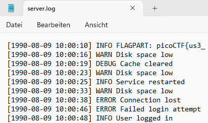
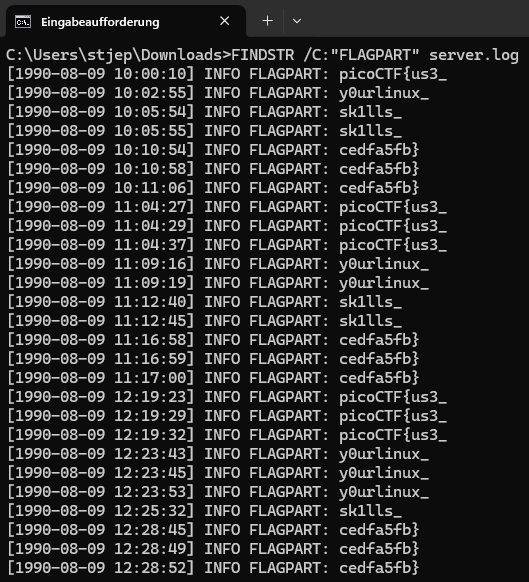

# Challenge: Log Hunt
**Category:** General Skills | **Difficulty:** Easy | **Author:** Yahaya Meddy

## 📝 Challenge Description
Our server seems to be leaking pieces of a secret flag in its logs. The parts are scattered and sometimes repeated. Can you reconstruct the original flag?

---

## 🔍 Analysis
After downloading and opening the `server.log` file, I noticed that the log entries were cluttered with standard INFO, WARN, and ERROR messages. However, many entries contained a specific keyword: `FLAGPART`.

<div align="center">
  
  <p><i>Figure 1: Initial inspection of 'server.log' showing log noise interspersed with 'FLAGPART' fragments.</i></p>
</div>

## 🛠️ Solution
To avoid searching through thousands of lines manually, I used the Windows Command Line tool `FINDSTR` to filter the log for all occurrences of the keyword "FLAGPART".

**Command used:**
```cmd
FINDSTR /C:"FLAGPART" server.log
```

The output revealed the fragments in a repetitive pattern. By identifying the unique parts and concatenating them, the full flag was reconstructed.

<div align="center">
  
  <p><i>Figure 2: Output of 'FINDSTR' filtering, allowing for systematic reconstruction of the flag.</i></p>
</div>

### Reconstructed Fragments:
1. `picoCTF{us3_`
2. `y0urlinux_`
3. `sk1lls_`
4. `cedfa5fb}`

---

## 🚩 Final Flag
<details>
  <summary>Click to reveal the flag</summary>
  
  `picoCTF{us3_y0urlinux_sk1lls_cedfa5fb}`
</details>

---

## 💡 What I learned
* **Pattern Recognition:** Identifying specific keywords within high-volume log data.
* **CLI Efficiency:** Using `FINDSTR` to filter relevant information from noise.
* **Data Recovery:** Reassembling secrets from scattered fragments.
