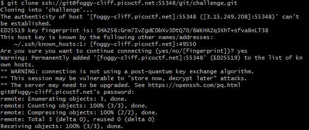
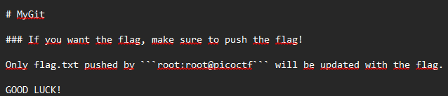
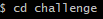
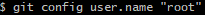
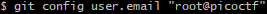
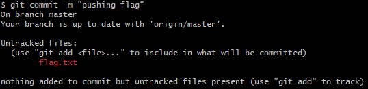
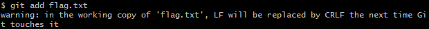
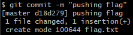
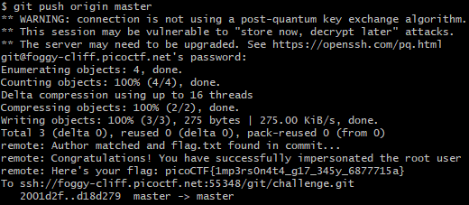

# Challenge: My Git
**Category:** General Skills | **Difficulty:** Easy | **Author:** DARKRAICG492

## 📝 Challenge Description
I have built my own Git server with my own rules! You can clone the challenge repo using the command below. Check the README to get your flag!

> **Note:** This challenge uses **dynamic instances**. Each user is assigned a unique SSH clone link and a custom password/credential set upon launching the instance.

---

## 🔍 Analysis

The challenge provides a custom Git server and a specific set of rules to obtain the flag.

### Initial Access
First, I cloned the repository from the unique SSH address provided for my instance. This created a local directory named `challenge`.

```bash
git clone ssh://git@foggy-cliff.picoctf.net:55348/git/challenge.git
```

<div align="center">
  
  <p><i>Figure 1: Cloning the unique remote repository instance to the local machine.</i></p>
</div>

### Investigating the Rules
Inside the repository, the `README.md` contained the crucial instructions.

<div align="center">
  
  <p><i>Figure 2: The README clarifies that only a 'flag.txt' pushed by 'root:root@picoctf' will be rewarded with the flag.</i></p>
</div>

The server implements a hook that checks the author's identity. To succeed, I needed to impersonate the user `root` as specified in the rules.

---

## 🛠️ Solution

### 1. Impersonation
I navigated into the repository and updated the local Git configuration to match the required credentials.

```bash
cd challenge
git config user.name "root"
git config user.email "root@picoctf"
```

<div align="center">
  
  
  
  <p><i>Figure 3: Setting the required 'root' identity in the local repository configuration.</i></p>
</div>

### 2. Creating the File
As per the instructions, the server expects a file named `flag.txt`. The content is irrelevant as the server validates the push identity and replaces the content with the actual flag.

```bash
echo "placeholder" > flag.txt
```

<div align="center">
  
  <p><i>Figure 4: Creating the placeholder 'flag.txt' file.</i></p>
</div>

### 3. Staging and Committing
My first attempt to commit failed because I forgot to stage the file. Git correctly identified `flag.txt` as an untracked file.

<div align="center">
  
  <p><i>Figure 5: Git warning about untracked files during the initial commit attempt.</i></p>
</div>

I corrected this by staging the file and then successfully committing it:

```bash
git add flag.txt
git commit -m "pushing flag"
```

<div align="center">
  
  
  <p><i>Figure 6: Staging the file and finalizing the commit as the authorized 'root' user.</i></p>
</div>

### 4. The Final Push
By pushing the commit to the remote server, the server-side hook verified the credentials and returned the flag directly in the terminal response.

```bash
git push origin master
```

<div align="center">
  
  <p><i>Figure 7: Successful push revealing the flag in the remote server's response.</i></p>
</div>

---

## 🚩 Final Flag
<details>
  <summary>Click to reveal the flag</summary>
  
  `picoCTF{1mp3rs0n4t10n_978018e6}`
</details>

---

## 💡 What I learned
* **Git Configuration:** Overriding global settings with local repository-specific identities.
* **Git Workflow:** Proper use of the staging area (`git add`) for new files.
* **Identity Hooks:** Understanding how Git servers use metadata (User/Email) for access control or automated tasks.
* **Instance Management:** Handling custom challenge instances with unique access credentials.
