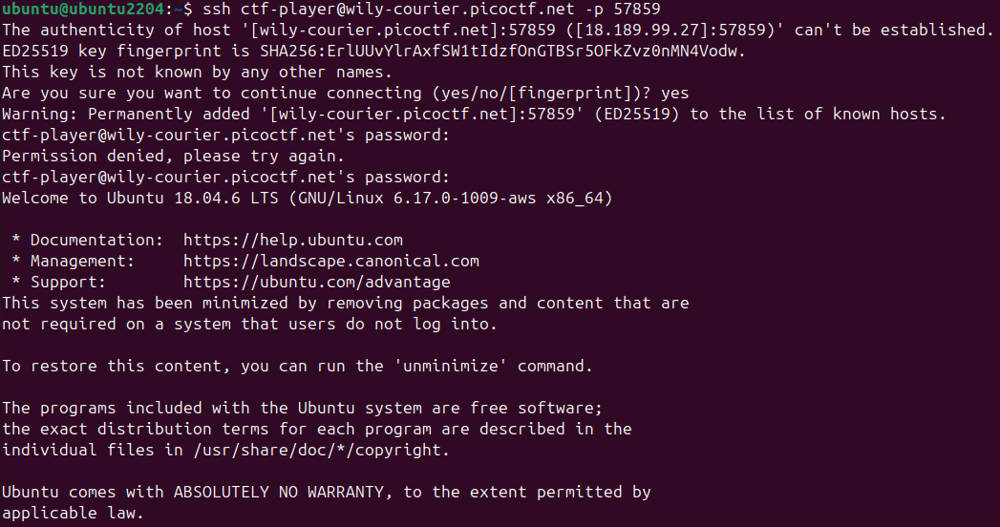
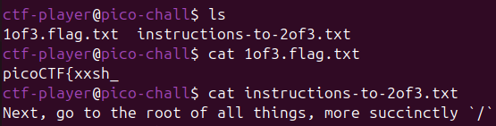
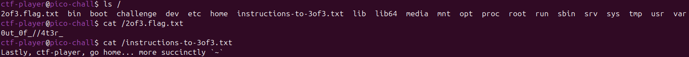
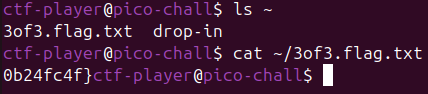

# 🎣 Challenge: Magikarp Ground Mission
**Category:** General Skills | **Difficulty:** Easy | **Author:** syreal

## 📝 Challenge Description
*"Do you know how to move between directories and read files in the shell? Start the container, ssh to it, and then ls once connected to begin."*

> **Note:** This challenge uses **dynamic instances**. Each session provides a unique host, port, and password. This walkthrough uses the instance `wily-courier.picoctf.net` at port `57859`.

---

## 🔍 Analysis

### 1. Initial Connection
I started by connecting to the remote server via SSH. As you can see in the screenshot, I had a little "Fat Finger" moment and mistyped the password on the first try (Classic!), but I got in on the second attempt.

  
  
<i>Figure 1: Accessing the challenge server (and failing the first password prompt like a pro).</i>

### 2. Part 1: The Home Directory
Once connected, I landed in the user's home directory.
* **Command:** `ls` showed `1of3.flag.txt` and `instructions-to-2of3.txt`.
* **Flag Part 1:** `cat 1of3.flag.txt` revealed `picoCTF{xxsh_`.
* **Hint:** The instructions told me to go to the "root of all things", which in Linux terms means `/`.

  
  
<i>Figure 2: Finding the first piece of the puzzle.</i>

### 3. Part 2: The Root Directory
I navigated to the root directory to find the next clue.
* **Command:** `ls /` showed the standard Linux root structure along with `2of3.flag.txt`.
* **Flag Part 2:** `cat /2of3.flag.txt` revealed `0ut_0f_//4t3r_`.
* **Hint:** The next instruction was to "go home... more succinctly `~`".

  
  
<i>Figure 3: Searching the root directory for the second part.</i>

### 4. Part 3: Back to Basics
Following the hint, I headed back to the home directory (using `cd ~` or just `cd`).
* **Command:** `ls` again, but this time looking for the final piece.
* **Flag Part 3:** `cat ~/3of3.flag.txt` revealed `0b24fc4f}`.

  
  
<i>Figure 4: Completing the mission in the home directory.</i>

---

## 🚩 Final Flag
After assembling all three parts from the different directories:

  
Click to reveal the flag

  
  `picoCTF{xxsh_0ut_0f_//4t3r_0b24fc4f}`

---

## 💡 Key Takeaways
* **Linux Navigation:** Practiced moving between the root directory (`/`) and the home directory (`~`).
* **Absolute vs. Relative Paths:** Learned how to target files specifically across the filesystem.
* **Persistence:** Even if you fail the password login once, just keep going!
