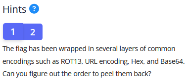
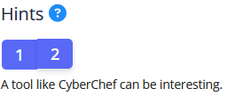
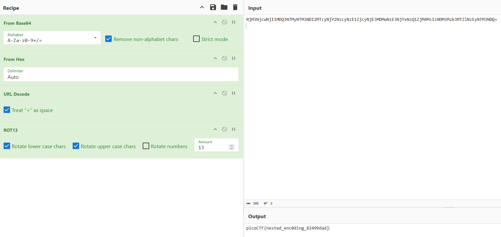

# Challenge: MultiCode
**Category:** General Skills | **Difficulty:** Easy | **Author:** Yahaya Meddy

## 📝 Challenge Description
"We intercepted a suspiciously encoded message, but it’s clearly hiding a flag. No encryption, just multiple layers of obfuscation. Can you peel back the layers and reveal the truth?"

---

## 🔍 Analysis

The challenge provides a file named `message.txt` with the following encoded string:
`NjM3NjcwNjI1MDQ3NTMyNTM3NDI2MTcyNjY2NzcyNzE1ZjcyNjE3MDMwNzE3NjYxNzQ1ZjM4MzIzNDM5Mzk3MTZlNzEyNTM3NDQ=`

### Hints
1. The flag is wrapped in several layers of common encodings: **ROT13**, **URL encoding**, **Hex**, and **Base64**.
2. A tool like **CyberChef** is recommended for decoding.

  
  
  
<i>Figure 1: Identifying the encoding layers and the recommended tool.</i>

---

## 🛠️ Solution

### 1. Using CyberChef
To decode the message, I used CyberChef. The string ends with an `=`, which is a strong indicator for **Base64** padding.

### 2. Peeling the Layers
By experimenting with the "Recipe" in CyberChef, I found the correct order to reveal the hidden flag:

1.  **From Base64**: Decodes the initial string into a long sequence of numbers.
2.  **From Hex**: Converts the numeric sequence into a URL-encoded format.
3.  **URL Decode**: Decodes the string into a ROT13-obfuscated flag.
4.  **ROT13**: Performs the final character rotation to align the flag correctly.

  
  
<i>Figure 2: The final CyberChef recipe showing the nested decoding process.</i>

---

## 🚩 Final Flag

  
Click to reveal the flag

  
  `picoCTF{nested_enc0ding_82499dad}`

---

## 💡 What I learned
* **Layered Obfuscation:** Recognizing the difference between encryption and encoding is key.
* **Pattern Identification:** `=` usually means Base64; long digit/letter pairs often suggest Hex.
* **Tool Proficiency:** CyberChef is essential for rapid prototyping of decoding recipes.
