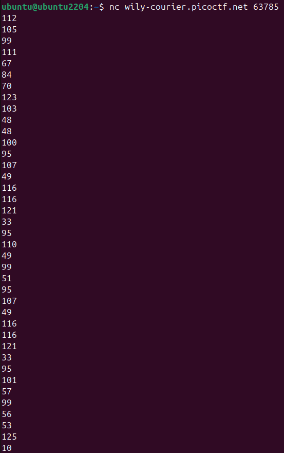
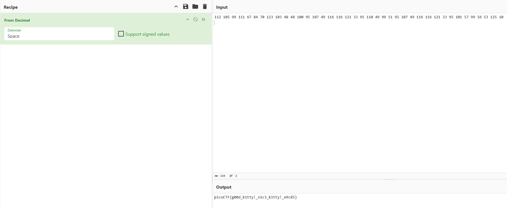

# 🔮 Challenge: Nice netcat...
**Category:** General Skills | **Difficulty:** Easy | **Author:** syreal

## 📝 Challenge Description
*"There is a nice program that you can talk to by using this command in a shell: nc [host] [port]"*

This challenge introduces a common scenario where a server communicates using raw decimal ASCII codes instead of plaintext. The goal is to capture the stream and decode it into a human-readable format.

---

## 🔍 Analysis
Connecting to the provided instance via Netcat resulted in a vertical list of numbers rather than a standard flag string. 

  
  
<i>Figure 1: The server response consists of a sequence of decimal values.</i>

A quick check of the first few numbers against an ASCII table confirmed the encoding:
* `112` -> **p**
* `105` -> **i**
* `99`  -> **c**
* `111` -> **o**

This pattern (`pico...`) clearly identifies the output as decimal-encoded ASCII characters.

---

## 🛠️ Solution

### Step 1: Data Extraction
I connected to the challenge instance using the provided Netcat command and copied the entire sequence of numbers. 

### Step 2: Decoding with CyberChef
To efficiently convert the large block of numbers, I used **CyberChef**:
1. I pasted the numbers into the **Input** field.
2. I applied the **"From Decimal"** recipe.
3. I set the delimiter to **"Space"** (after reformatting the vertical list into a space-separated string).
4. The **Output** field instantly revealed the decoded flag.

  
  
<i>Figure 2: Using CyberChef to translate the decimal sequence into the final flag.</i>

---

## 🚩 Final Flag

  
Click to reveal the flag

  
  `picoCTF{g00d_k1tty!_n1c3_k1tty!_e9c85}`

---

## 💡 Key Takeaways
* **ASCII Familiarity:** Recognizing that numbers in the range of 32-126 often represent printable ASCII characters.
* **Stream Processing:** Learning how to handle multi-line output from a network socket and prepare it for decoding tools.
* **Tool Versatility:** Using CyberChef's "From Decimal" recipe as a faster alternative to manual lookup or custom scripting.
