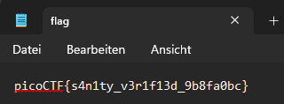

# Challenge: Obedient Cat
**Category:** General Skills | **Difficulty:** Easy | **Author:** syreal

## Challenge Description
*"This file has a flag in plain sight (aka 'in-the-clear')."*

This is a fundamental "Sanity Check" challenge. Its purpose is to verify that a participant can correctly download a resource and read its contents, which are stored in "plaintext" (unencrypted and unencoded).

---

## Analysis
In Cybersecurity, **"In-the-clear"** or **"Plaintext"** refers to data that is transmitted or stored without any encryption or obfuscation. While this is rare for actual flags in advanced challenges, it is a common vulnerability in real-world scenarios where sensitive information (like passwords or API keys) is accidentally left in publicly accessible text files.

---

## Solution

### Step 1: File Inspection
After downloading the file named `flag`, I opened it using a standard text editor (Notepad on Windows 11). As the description suggested, no further decoding or complex analysis was required.

<div align="center">
  
  <p><i>Figure 1: Opening the 'flag' file directly reveals the flag in plaintext.</i></p>
</div>

### Step 2: Alternative CLI Method
In a Linux environment (like Ubuntu), the same result can be achieved instantly using the `cat` command, which is the namesake of this challenge:
```bash
cat flag
```

---

## 🚩 Final Flag
<details>
  <summary>Click to reveal the flag</summary>
  
  `picoCTF{s4n1ty_v3r1f13d_9b8fa0bc}`
</details>

---

## Key Takeaways
* **Terminology:** Understanding "In-the-clear" as data without protection.
* **Basic Tooling:** Using `cat` (Linux) or text editors (Windows) to inspect file contents.
* **Sanity Checks:** Even the simplest tasks are part of a structured methodology in security analysis.
