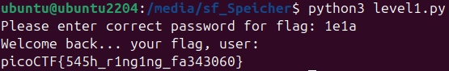

# Challenge: PW Crack 1
**Category:** General Skills | **Difficulty:** Easy | **Author:** LT 'syreal' Jones

## Challenge Description
"Can you crack the password to get the flag? Download the password checker here and you'll need the encrypted flag in the same directory too."

This challenge introduces basic static analysis of source code to find hardcoded credentials.

## Analysis & Solution
We are provided with a Python script (`level1.py`) and an encrypted text file (`level1.flag.txt.enc`). The description hints that we need to find the correct password to decrypt the flag.

Instead of trying to brute-force the password or blindly guess, the most efficient approach is to inspect the source code of the provided Python script.

Looking at the `level_1_pw_check()` function within the script, the authentication logic is clearly visible in plain text[cite: 1]:
```python
def level_1_pw_check():
    user_pw = input("Please enter correct password for flag: ")
    if( user_pw == "1e1a"):
        print("Welcome back... your flag, user:")
        decryption = str_xor(flag_enc.decode(), user_pw)
        print(decryption)
        return
    print("That password is incorrect")
```

The script simply compares the user's input against the hardcoded string `"1e1a"`[cite: 1]. 

### Execution Step
I opened my Linux terminal, navigated to the directory containing both files, and executed the script. When prompted for the password, I inputted `1e1a`[cite: 1]. The script verified the password, used it to decipher the encrypted file, and successfully printed the flag.



*Figure 1: Executing the script and providing the hardcoded password to reveal the flag.*

## Final Flag
<details>
  <summary>Click to reveal the flag</summary>

  🚩 `picoCTF{545h_r1ng1ng_fa343060}`
</details>

## Key Takeaways
* **Static Analysis:** Simply reading the provided source code is often the fastest way to understand how a program works and identify vulnerabilities.
* **Hardcoded Credentials:** Storing passwords, API keys, or secrets in plain text within source code is a major security flaw, as anyone with access to the file can immediately compromise the system.
