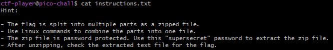
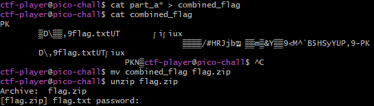
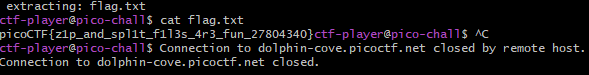

# Challenge: Piece by Piece
**Category:** General Skills | **Difficulty:** Easy | **Author:** Yahaya Meddy

## 📝 Challenge Description
After logging in, you will find multiple file parts in your home directory. These parts need to be combined and extracted to reveal the flag. 

> **Note:** This challenge uses **dynamic instances**. Each user gets a unique SSH connection and a custom password to log in.

---

## 🔍 Analysis

The challenge requires gathering fragments, finding a hidden password, and extracting a protected archive.

### Initial Access
I connected to the instance via SSH using the provided credentials.
```bash
ssh ctf-player@saturn.picoctf.net -p 52136
```

### Finding the Password
In the home directory, I found an `instructions.txt` file. Upon reading it, I discovered a "supersecret" password required for the next steps.
<div align="center">
  
  <p><i>Figure 1: Reading instructions.txt to find the decryption password.</i></p>
</div>

---

## 🛠️ Solution

### 1. Combining the Fragments
I identified four fragments (`part1` to `part4`) and combined them into a single file. For better clarity, I named the output `flag.zip`.
```bash
cat part1 part2 part3 part4 > flag.zip
```
<div align="center">
  
  <p><i>Figure 2: Merging fragments into flag.zip and verifying the content.</i></p>
</div>

### 2. Extracting with Password
Next, I used the `unzip` command. The system prompted for a password, where I entered the "supersecret" string found earlier.
```bash
unzip flag.zip
```
<div align="center">
  
  <p><i>Figure 3: Successfully extracting the archive using the discovered password.</i></p>
</div>

### 3. Retrieving the Flag
Once extracted, a new file appeared. Using `cat` on this file revealed the final flag.

---

## 🚩 Final Flag
<details>
  <summary>Click to reveal the flag</summary>
  
  `picoCTF{c0mb1n3_4nd_3xtr4ct_6f194382}`
</details>

---

## 💡 What I learned
* **Password Discovery:** Checking text files (`instructions.txt`) for hidden credentials.
* **File Handling:** Combining fragments with `cat` and renaming for correct file-type handling.
* **Archive Security:** Working with password-protected ZIP files in the Linux terminal.
