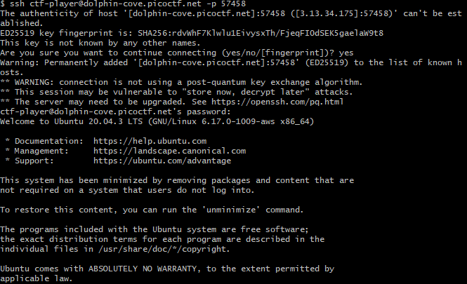
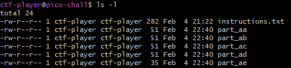

# Challenge: Piece by Piece
**Category:** General Skills | **Difficulty:** Easy | **Author:** Yahaya Meddy

## 📝 Challenge Description
After logging in, you will find multiple file parts in your home directory. These parts need to be combined and extracted to reveal the flag.

> **Note:** This challenge uses **dynamic instances**. Each user is assigned a unique SSH connection string and a custom password for the initial login.

---

## 🔍 Analysis

The challenge environment is a remote Linux server. The objective is to gather fragmented files, identify a hidden password, and reconstruct a protected archive.

### Initial Access (SSH)
First, I launched the challenge instance and connected via SSH using the provided command. During this step, I had to enter the instance-specific password to gain access to the `ctf-player` account.

<div align="center">
  
  <p><i>Figure 1: Establishing the remote connection via SSH.</i></p>
</div>

### Environment Inspection
Once connected, I listed the contents of the home directory using `ls`. I identified four fragments (`part1` to `part4`) and a file named `instructions.txt`.

<div align="center">
  
  <p><i>Figure 2: Viewing the directory content after a successful login.</i></p>
</div>

### Reading the Instructions
I used `cat instructions.txt` to read the mission brief. The file contained detailed instructions and, most importantly, the **"supersecret" password** needed to unlock the final archive.

<div align="center">
  
  <p><i>Figure 3: Discovering the password within the 'instructions.txt' file.</i></p>
</div>

---

## 🛠️ Solution

### 1. Combining and Testing the Fragments
I followed the provided command to merge all four parts into a single file. Initially, I just concatenated them, but then I curiously tried to `cat` the resulting file directly to see if the flag was visible. As expected, it was a binary mess.

To make the file easier to handle for the extraction tools, I renamed/saved it as `flag.zip`.

```bash
cat part1 part2 part3 part4 > flag.zip
```

<div align="center">
  
  <p><i>Figure 4: Combining fragments and testing the output.</i></p>
</div>

### 2. Extracting with the Password
Using the `unzip` command on `flag.zip`, I was prompted for a password. I entered the "supersecret" password previously found in the instructions.

```bash
unzip flag.zip
```

### 3. Final Flag Retrieval
After entering the password successfully, the archive was extracted. The final step was to use `cat` on the extracted file to reveal the flag.

<div align="center">
  
  <p><i>Figure 5: Successfully entering the password and displaying the final flag.</i></p>
</div>

---

## 🚩 Final Flag
<details>
  <summary>Click to reveal the flag</summary>
  
  `picoCTF{z1p_and_spl1t_f1l3s_4r3_fun_27804340}`
</details>

---

## 💡 What I learned
* **SSH Interaction:** Connecting to remote challenge instances with custom credentials.
* **Information Gathering:** Reading instructional files to find hidden passwords.
* **Archive Handling:** Using `cat` to reconstruct split files and `unzip` to handle protected archives.
* **CLI Troubleshooting:** Identifying binary files and using appropriate tools instead of just `cat`.
