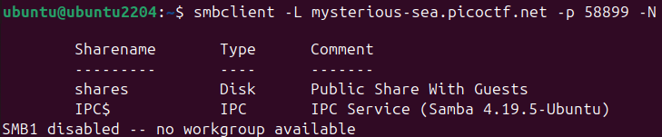
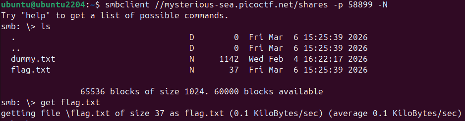
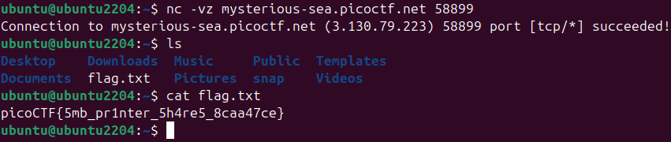

# 🖨️ Challenge: Printer Shares
**Category:** General Skills | **Difficulty:** Easy | **Author:** Janice He | **Environment:** Ubuntu 22.04 (VirtualBox)

## 📝 Challenge Description
*"Oops! Someone accidentally sent an important file to a network printer—can you retrieve it from the print server?"*

The challenge points to a network printer hosted on port **58899**. We are tasked with intercepting or retrieving a file that was "accidentally" sent to this print server.

---

## 🔍 Analysis & The "Local vs. Remote" Trap

### 1. Testing the Connection
The challenge starts with a suggested command: `nc -vz mysterious-sea.picoctf.net 58899`. 
* **`nc` (Netcat)**: Used here to "ping" the port.
* **`-v` (Verbose)**: Tells us what’s happening.
* **`-z` (Zero-I/O)**: Scans for an open port without sending data.

The connection succeeded, which confirmed the service was up.

### 2. The Five-Minute Confusion
After the connection was successful, I instinctively ran `ls` to see the files on the server. I spent about 5 minutes browsing through a bunch of directories, trying to find the "important file." 

  
  
<i>Figure 1: Running 'ls' after the nc connection.</i>

**The Realization:**
As seen in **Figure 1**, the folders listed (Desktop, Documents, Downloads, etc.) were actually my **own local directories** on my Ubuntu VM. 
* **Why?** Netcat (`nc -vz`) only checks if the port is "listening." It doesn't log you into the server or mount a file system. When I typed `ls`, I was still just looking at my own home folder. 

### 3. Solving the Protocol Puzzle
Since a simple connection didn't work, I looked at the **Hints**:
* *Hint 1:* "Knowing how SMB protocol works would be helpful!"
* *Hint 2:* "smbclient and smbutil are good tools."

This was the "Aha!" moment. Printers and network file shares commonly use **SMB (Server Message Block)**. To see the server's files, I needed a tool that speaks that specific protocol.

---

## 🛠️ The Solution: SMB Enumeration

### Step 1: Listing Remote Shares
I used `smbclient` to ask the server for its public folders (Shares).
* **`-L`**: List the available shares.
* **`-p 58899`**: Target the non-standard port.
* **`-N`**: Use a "Null Session" (Anonymous/No password).

  
  
<i>Figure 2: Successfully listing the remote shares on the print server.</i>

The server responded with a share called **`shares`**, described as a "Public Share With Guests." This was finally the remote directory we were looking for.

### Step 2: Accessing the Remote Files
I connected directly to the `shares` directory. This time, when I ran `ls` inside the SMB shell, I wasn't seeing my local Ubuntu files—I was seeing the **actual server content**.

  
  
<i>Figure 3: Finding flag.txt inside the remote SMB share.</i>

**Workflow:**
1. **Connect:** `smbclient //mysterious-sea.picoctf.net/shares -p 58899 -N`
2. **Retrieve:** Once the `flag.txt` was visible, I used the `get` command to download it to my local machine.

### Step 3: Capturing the Flag
Finally, I checked my local directory again. The file `flag.txt` was now there, and I could read it using `cat`.

  
  
<i>Figure 4: The flag revealed in the local Ubuntu terminal.</i>

---

## 🚩 Final Flag
`picoCTF{5mb_pr1nter_5h4re5_8caa47ce}`

---

## 💡 Key Takeaways
* **Netcat is a Probe, not a Shell:** `nc -vz` is great for checking if a service exists, but it won't let you browse files if the protocol (like SMB) requires a specific client.
* **Don't browse your own PC:** If you run `ls` and see "Desktop" or "Downloads," you haven't actually moved into the target server yet!
* **Guest Access Vulnerabilities:** SMB shares are often left open with "Guest" permissions, making them a prime target for data leaks in network environments.
