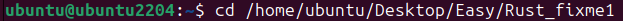
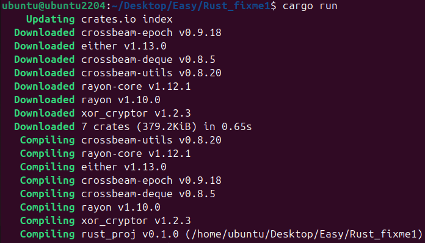
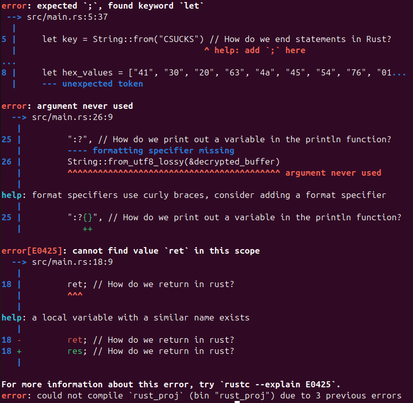
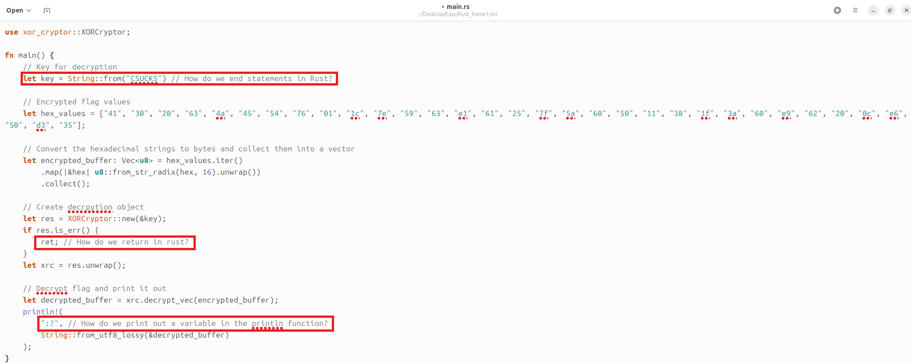
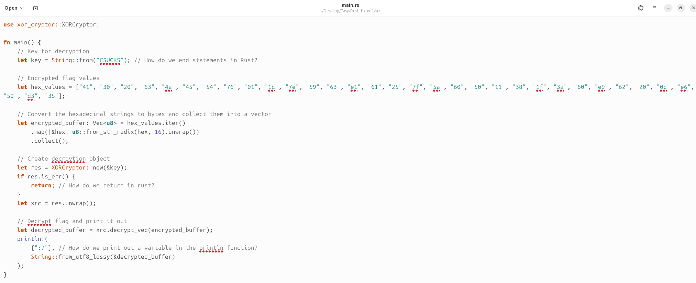
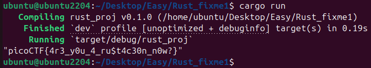

# Challenge: Rust fixme 1
**Category:** General Skills | **Difficulty:** Easy | **Author:** Taylor McCampbell

## Challenge Description
"Have you heard of Rust? Fix the syntax errors in this Rust file to print the flag!"
This challenge is a classic introduction to Rust's strict syntax and the `cargo` build system. Unlike other challenges, this one requires a local environment to compile and run code that uses external dependencies.

---

## Analysis

### Initial Environment Setup
The challenge provided a small Rust project with some intentional syntax errors. The goal: fix the code to decrypt and print the flag.

  
  
<i>Figure 1: Navigating to the project directory in the Ubuntu terminal.</i>

### The "Shoot First, Ask Questions Later" Approach
I attempted to run the program immediately with `cargo run`. In the Rust ecosystem, this command compiles your code and executes the resulting binary in one go.

  
  
<i>Figure 2: Cargo downloading dependencies and starting the compilation process.</i>

### Debugging via Compiler Feedback
Rust is famous for its "helpful" compiler. Instead of just crashing, it provided a detailed roadmap of every syntax error in the file.

  
  
<i>Figure 3: Detailed error messages pointing out missing semicolons and invalid keywords.</i>

The errors confirmed what the author hinted at in the code comments:
1. **Semicolons:** Rust statements (like `let`) must end with `;`.
2. **Keywords:** The code used `ret`, but Rust requires the full `return` keyword.
3. **Macros:** The `println!` macro was missing the format specifier `{}` and a comma.

---

## Solution

### 1. Code Refactoring
I opened the `main.rs` file and applied the fixes as suggested by the compiler and the inline comments.

  
  
<i>Figure 4: Visualizing the syntactical "traps" in the original source code.</i>

**Key Changes:**
* Added `;` after the `key` declaration.
* Changed `ret;` to `return;`.
* Corrected the `println!` macro to `println!("{}", ...);`.

### 2. Execution & Flag Recovery
After saving the changes, I ran `cargo run` again. This time, the code compiled successfully, executed the XOR decryption logic, and revealed the flag.

  
  
<i>Figure 5: The corrected source code, ready for execution.</i>

---

## 🚩 Final Flag
After fixing the syntax, the program output the following flag:

  
  
<i>Figure 6: The successful output in the terminal.</i>

  
Click to reveal the flag

  
  `picoCTF{4r3_y0u_4_ru$t4c30n_n0w?}`

---

## Key Takeaways
* **Rust's Strictness:** Learned that Rust's compiler is a powerful ally that enforces memory safety and correct syntax before the code even runs.
* **Cargo Power:** Experienced how easily Rust manages external crates (like `xor_cryptor`) via the `Cargo.toml` manifest.
* **Modern Tooling:** Transitioning from IntelliJ to a Linux-based CLI workflow for low-level language debugging.
* **XOR Decryption:** Understood how a simple key-based XOR operation can obfuscate data.

---
