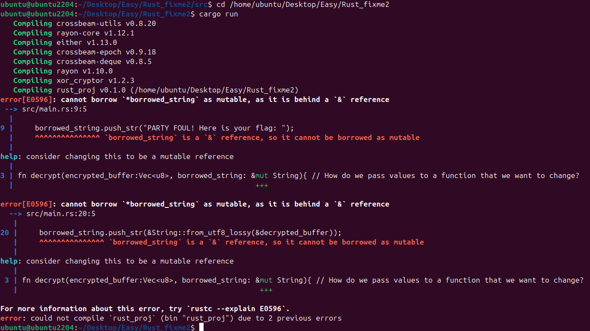
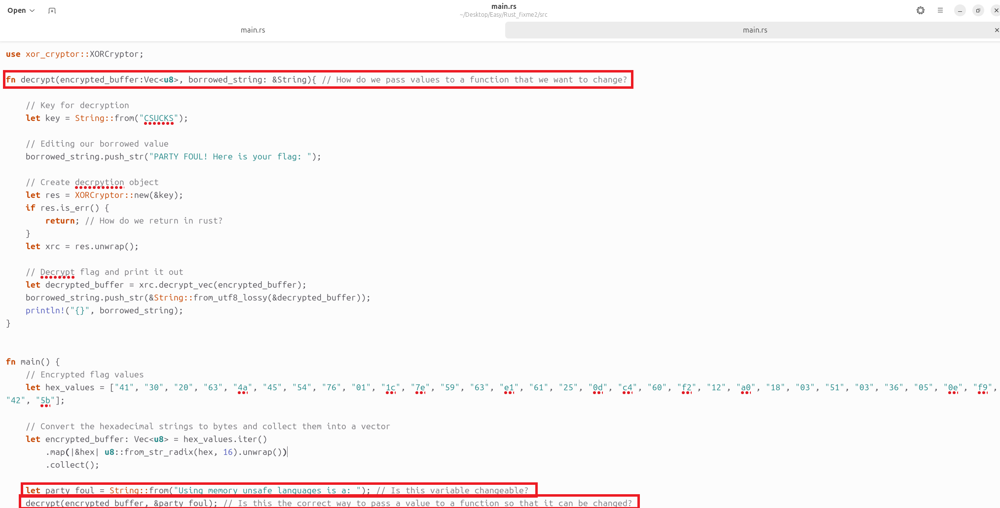
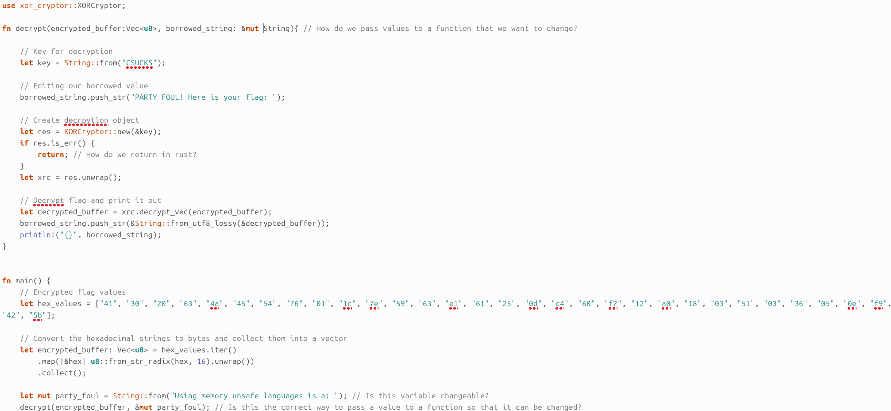
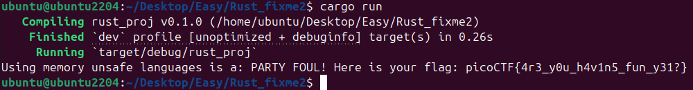

# 🦀 Challenge: Rust fixme 2
**Category:** General Skills | **Difficulty:** Easy | **Author:** Taylor McCampbell

## 📝 Challenge Description
*"The Rust saga continues? I ask you, can I borrow that, pleeeeeaaaasseeeee?"*

This challenge is a direct lesson in Rust's ownership and borrowing system. Unlike the first challenge, fixing simple syntax isn't enough; you have to understand how to move and borrow data safely.

---

## 🔍 Analysis

### The Compiler as a Mentor
As with the first challenge, I started by running `cargo run` to see how the compiler reacts. Rust’s error messages (E0596) are incredibly descriptive—it practically told me to use `&mut` before I even analyzed the logic.

  
  
<i>Figure 1: The compiler explaining that I cannot borrow a string as mutable if it's behind a shared reference.</i>

### Why did it fail? (The "Smart" Part)
In Rust, variables are **immutable by default**. To fix the code in `rust_fixme2_2`, I had to address two main issues:

1.  **Variable Declaration:** The variable `party_foul` was declared with `let`, making it a read-only constant.
2.  **Function Signature:** The function `decrypt` expected a `&String` (a shared/read-only reference). However, the function tries to use `.push_str()`, which requires **exclusive write access**.

**The Rule of Thumb:** You can have many readers (`&T`), but only ever **one** writer (`&mut T`) at a time. This prevents "Data Races" at compile time, something languages like C or Java struggle with at runtime.

  
  
<i>Figure 2: Identifying the missing 'mut' keywords in the original source.</i>

---

## 🛠️ Solution

### 1. Implementing Mutability
I applied the `mut` keyword in three strategic locations:
* **The declaration:** `let mut party_foul = ...` (Tells Rust the memory can be changed).
* **The function call:** `decrypt(..., &mut party_foul)` (Explicitly giving the function permission to modify the original string).
* **The function signature:** `fn decrypt(..., borrowed_string: &mut String)` (Declaring that this function *will* modify the input).

  
  
<i>Figure 3: The corrected code using mutable references.</i>

---

## 🚩 Final Flag
Running the corrected program successfully modified the string and decrypted the flag.

  
  
<i>Figure 4: Final output showing the combined string and flag.</i>

  
Click to reveal the flag

  
  `picoCTF{4r3_y0u_h4v1n5_fun_y31?}`

---

## 💡 Key Takeaways
* **Ownership & Borrowing:** Understanding the difference between `&` (shared) and `&mut` (exclusive) references.
* **Explicit Mutability:** Realizing that in Rust, "change" is a permission that must be explicitly granted.
* **Memory Safety:** Seeing how the compiler prevents potential bugs (like modifying a string while another part of the program might be reading it) before the program even runs.
