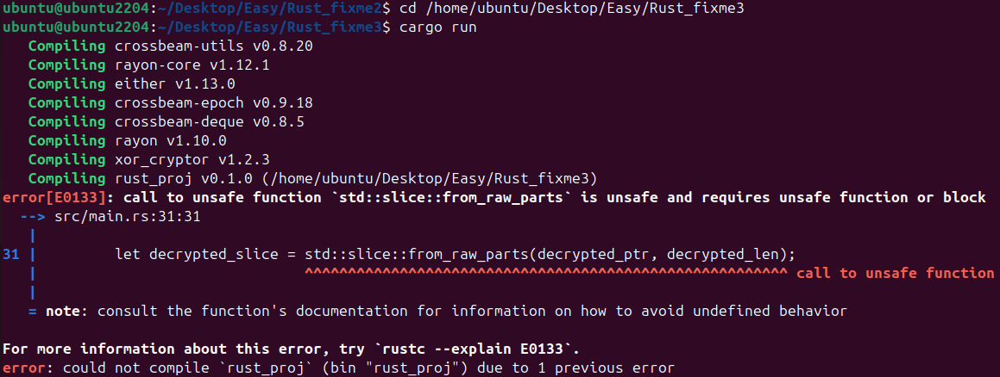
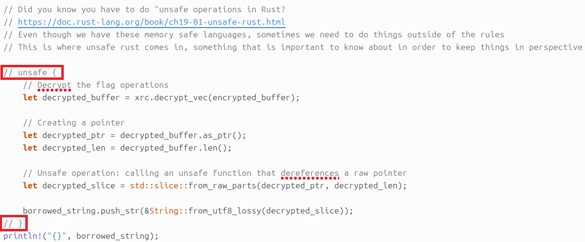
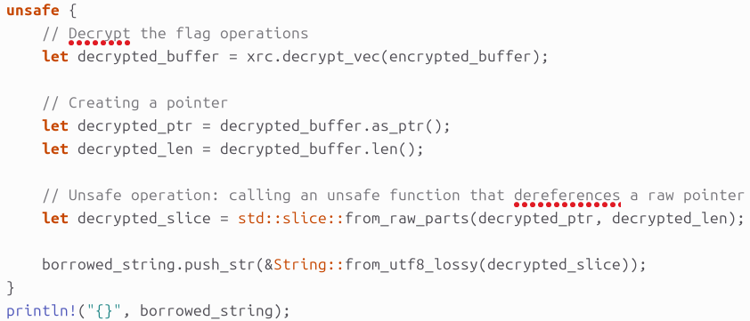
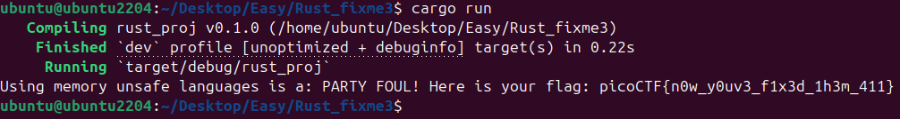

# 🦀 Challenge: Rust fixme 3
**Category:** General Skills | **Difficulty:** Easy | **Author:** Taylor McCampbell

## 📝 Challenge Description
*"Have you heard of Rust? Fix the syntax errors in this Rust file to print the flag!"*

This problem requires understanding that while Rust is a memory-safe language, it provides a "backdoor" called `unsafe` to bypass certain rules for low-level system operations.

---

## 🔍 Analysis

### A Cryptic Error Message
As usual, I started with `cargo run`. While Rust's compiler is normally a helpful mentor, this time it was more of a strict guard. It flagged error E0133, telling me that calling an unsafe function like `std::slice::from_raw_parts` requires an unsafe function or block.

  
  
<i>Figure 1: The compiler refusing to dereference a raw pointer without explicit permission.</i>

### Why it Failed (The Low-Level Details)
The fix itself was trivial, as the author provided commented-out `unsafe { ... }` blocks in `rust_fixme3_2`. However, understanding *why* this is necessary is critical for system programming:

1.  **Raw Pointers:** The code creates a nackte Speicheradresse (raw pointer) with `as_ptr()`. Unlike Rust’s regular references (`&T`), raw pointers are not tracked for validity.
2.  **Pointer Dereferencing:** The function `std::slice::from_raw_parts` takes this pointer and a length to create a slice. This is extremely dangerous. If the pointer is invalid (dangling) or the length is wrong (buffer overflow), the program will crash or worse—leak memory.
3.  **The `unsafe` Contract:** By using an `unsafe` block, you are essentially telling the compiler: *"I, the programmer, guarantee that this pointer and length are valid. Do not run the borrow checker on this section."*

The author strategically commented out the unsafe blocks in Figure 2 to force the programmer to confront this system-level reality.

  
  
<i>Figure 2: The source code highlighting the commented-out unsafe block that needs to be activated.</i>

---

## 🛠️ Solution

### 1. Activating the Unsafe Block
I simply removed the comment markers (`//`) around the `unsafe { ... }` block that was already present in `src/main.rs`. This explicitly told Rust that the programmer accepts responsibility for the pointer dereferencing within that scope.

  
  
<i>Figure 3: The corrected code with the 'unsafe' scope enabled.</i>

---

## 🚩 Final Flag
Running `cargo run` again successfully compiled the program and revealed the flag.

  
  
<i>Figure 4: Final output from the terminal showing the flag.</i>

  
Click to reveal the flag

  
  `picoCTF{n0w_y0uv3_f1x3d_1h3m_411}`

---

## 💡 Key Takeaways
* **Unsafe Rust:** Learned that Rust provides a defined mechanism to temporarily bypass its safety guarantees.
* **Low-Level Access:** Understanding how raw pointers, lengths, and memory dereferencing work "under the hood" in a system-safe language.
* **Perspective:** While Rust prevents many bugs, knowing about `unsafe` is vital for understanding why C/C++ require so much manual effort for memory safety.
