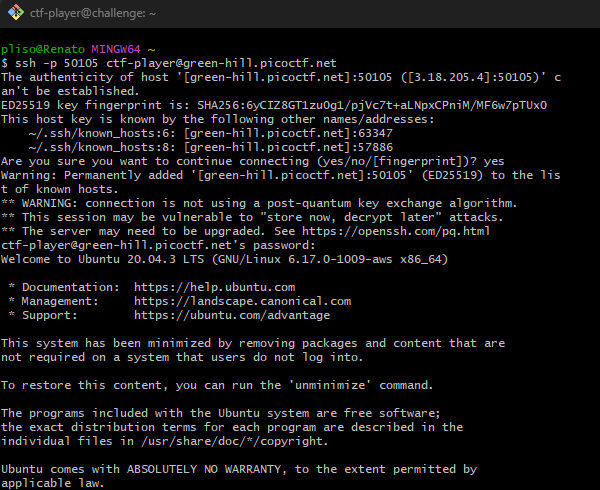
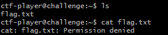
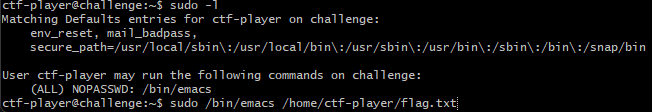
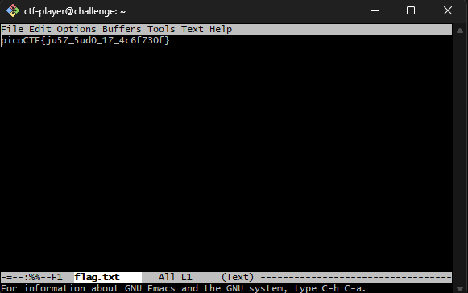

# Challenge: Sudo Make Me a Sandwich
**Category:** General Skills | **Difficulty:** Easy | **Author:** Darkraicg492

## Challenge Description
"SUDO MAKE ME A SANDWICH" – Can you read the flag? I think you can!

> **Note:** This challenge uses **dynamic instances**. Each user is assigned a unique SSH connection and a custom password for the initial login.

---

## Analysis

The challenge focuses on Linux privilege escalation. The goal is to read a restricted file by exploiting sudo permissions.

### Initial Access
I connected to the remote server via SSH using the provided instance credentials.
```bash
ssh -p 50105 ctf-player@green-hill.picoctf.net
```
After entering the password `61ecc684`, I successfully logged into the environment.

<div align="center">
  
  <p><i>Figure 1: Accessing the challenge instance via SSH.</i></p>
</div>

### Identifying the Target
Upon listing the directory contents, I found `flag.txt`. However, attempting to read it with `cat` resulted in a "Permission denied" error, as the current user does not have the required read permissions for this file.

<div align="center">
  
  <p><i>Figure 2: Attempting to read flag.txt without sufficient privileges.</i></p>
</div>

---

## Solution

### 1. Checking Sudo Privileges
To see if the current user has any administrative advantages, I ran `sudo -l`. This command lists the allowed commands for the user. I discovered a "golden key":

`(ALL) NOPASSWD: /bin/emacs`

This means I am allowed to run the **Emacs** text editor as a superuser (root) without being prompted for a password.

<div align="center">
  
  <p><i>Figure 3: Checking sudo permissions and identifying the Emacs exploit path.</i></p>
</div>

### 2. Exploiting Emacs to Read the Flag
Since Emacs can be run as root, I used it to open the `flag.txt` file directly with elevated privileges. Emacs is a powerful tool that allows viewing files that are otherwise restricted to the root user.

```bash
sudo /bin/emacs /home/ctf-player/flag.txt
```

<div align="center">
  
  <p><i>Figure 4: Reading the flag file within the Emacs editor running as root.</i></p>
</div>

---

## 🚩 Final Flag
<details>
  <summary>Click to reveal the flag</summary>
  
  `picoCTF{ju57_5ud0_17_4c6f730f}`
</details>

---

## What I learned
* **Privilege Escalation:** How to identify "low-hanging fruit" by checking `sudo -l` for binaries that can run with `NOPASSWD`.
* **Binaries as Attack Vectors:** Even seemingly harmless tools like text editors (Emacs, Vi, Nano) can be used to bypass security restrictions if misconfigured in the sudoers file.
* **GTFOBins:** This challenge is a practical example of why it's dangerous to give sudo access to powerful editors.
