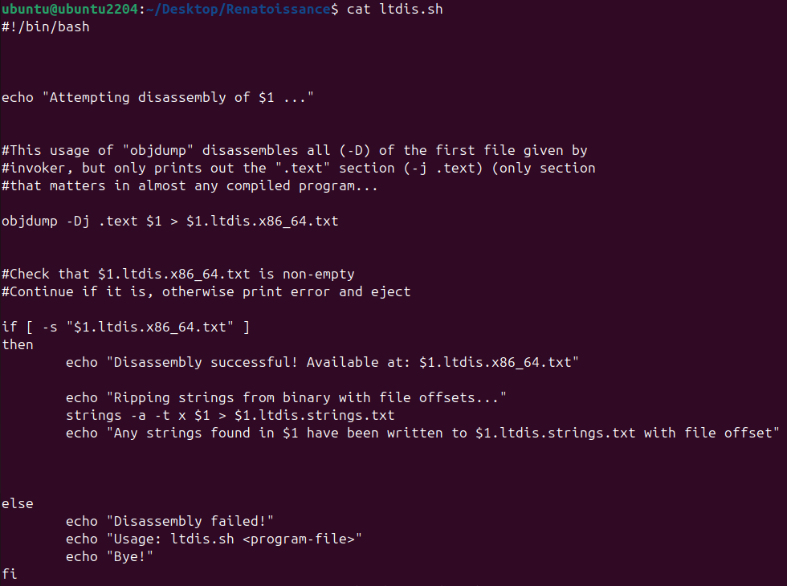
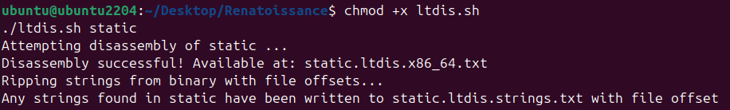
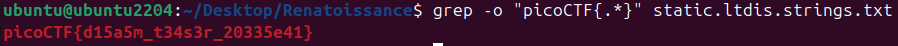

# 🔮 Challenge: Static ain't always noise
**Category:** General Skills | **Difficulty:** Easy | **Author:** syreal

## 📝 Challenge Description
*"Can you look at the data in this binary? The bash script might help!"*

This challenge demonstrates how to extract human-readable information from a compiled binary file using both provided helper scripts and standard Linux utilities like `strings` and `grep`.

---

## 🔍 Analysis
We are provided with two files:
1. `static`: A compiled binary file (ELF).
2. `ltdis.sh`: A shell script designed to assist in "dissecting" the binary.

Before executing the script, I inspected its contents using `cat`.

<div align="center">
  
  <p><i>Figure 1: Analyzing the 'ltdis.sh' script with 'cat'.</i></p>
</div>

The script is a wrapper. It checks if the input file is a valid binary and then runs two main operations:
* **String Extraction:** Finding all printable character sequences.
* **Disassembly:** Translating machine code (binary) back into human-readable Assembly language.

---

## 🛠️ Solution

### Step 1: Managing Permissions with `chmod +x`
By default, newly downloaded scripts often lack the permission to be executed for security reasons. To run the script, I had to modify its **file mode**:

```bash
chmod +x ltdis.sh
```
* **`chmod`**: "Change Mode" command.
* **`+x`**: Adds the **eXecute** flag, allowing the system to run the file as a program.

<div align="center">
  
  <p><i>Figure 2: Granting executable permissions and running the script on the 'static' binary.</i></p>
</div>

### Step 2: Locating the Flag
The script generates a file named `static.ltdis.strings.txt`. This is a "Strings Dump". Binaries often contain hardcoded text like error messages, URLs, or—in this case—the flag itself.

Instead of scrolling through thousands of lines, I used `grep` to filter the output:

```bash
grep "picoCTF" static.ltdis.strings.txt
```

<div align="center">
  
  <p><i>Figure 3: Using grep to find the flag in the strings dump.</i></p>
</div>

---

## 🚩 Final Flag
<details>
  <summary>Click to reveal the flag</summary>
  
  `picoCTF{d15a5m_t34s3r_20335e41}`
</details>

---

## 💡 Key Takeaways
* **Linux Permissions:** Files are not executable by default; `chmod +x` is the standard way to enable script execution.
* **Static Analysis Tools:** Helper scripts often hide the complexity of tools like `objdump` (for disassembly) and `strings`.
* **Binary Forensics:** Even without running a program, sensitive data can be recovered from its static structure.
