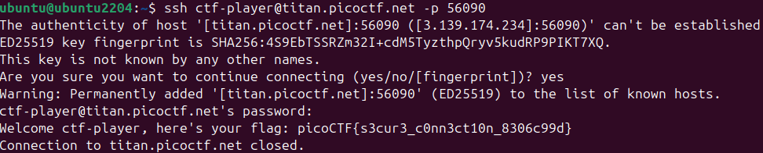

# Challenge: Super SSH
**Category:** General Skills | **Difficulty:** Easy | **Author:** Jeffery John

## 📝 Challenge Description
*"Using a Secure Shell (SSH) is going to be pretty important. Can you ssh as ctf-player to titan.picoctf.net at port 56090 to get the flag?"*

> **Note:** This challenge uses **dynamic instances**. Each user is assigned a unique SSH connection string and a custom password for the initial login.

---

## 🔍 Analysis

### The SSH Protocol
To solve this, I connected to a remote host using the parameters provided in my specific instance:
* **Username:** `ctf-player`
* **Host:** `titan.picoctf.net`
* **Port:** `56090` (specified via the `-p` flag)
* **Password:** `1ad5be0d`

### Execution in a Virtual Environment
I performed the connection within a local **Ubuntu 22.04 environment running in VirtualBox**. Using a native terminal is essential for practicing real-world CLI skills.

**The Command:**
`ssh ctf-player@titan.picoctf.net -p 56090`

1.  **Handshake:** The server presented an ED25519 key fingerprint. I accepted it by typing `yes` to establish authenticity.
2.  **Authentication:** I entered the instance-specific password when prompted.
3.  **Flag Retrieval:** Upon login, the server displayed the flag and automatically closed the session.

  
  
<i>Figure 1: Terminal output showing the SSH login process and flag capture.</i>

---

## 🚩 Final Flag
After the successful handshake and login, the server revealed:

  
Click to reveal the flag

  
  `picoCTF{s3cur3_c0nn3ct10n_8306c99d}`

---

## 💡 Key Takeaways
* **Dynamic Instances:** Recognized that ports and passwords vary per user session in this challenge.
* **SSH Basics:** Mastered the use of custom ports and host verification.
* **Environment:** Successfully managed the connection using a Linux Virtual Machine.
