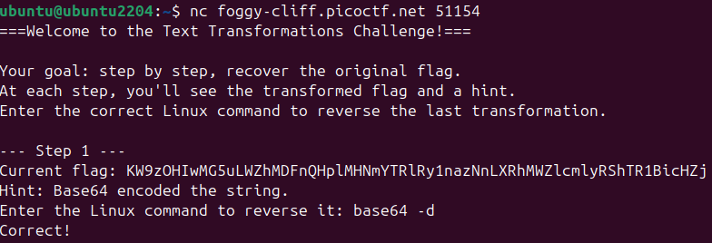
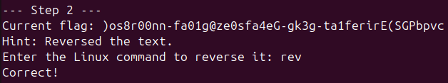
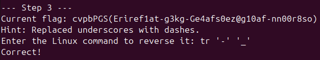
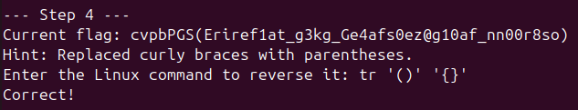
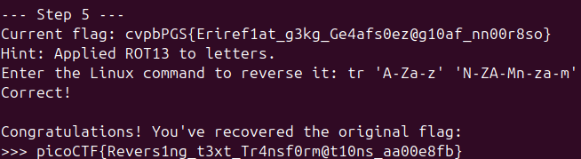

# 🔮 Challenge: Undo
**Category:** General Skills | **Difficulty:** Easy/Medium | **Author:** Yahaya Meddy

## 📝 Challenge Description
*"Can you reverse a series of Linux text transformations to recover the original flag? Start searching for the flag here nc foggy-cliff.picoctf.net 51154"*

This challenge tests your knowledge of basic Linux text manipulation commands. You connect to a remote server which feeds you a mangled string and gives you hints about how it was altered. You must provide the correct Linux command to reverse each step.

---

## 🔍 Analysis

The challenge environment is accessed via `nc` (Netcat). Instead of a standard shell, you are greeted by an interactive prompt that requires you to "undo" transformations step-by-step. 

To solve this, I had to analyze the hint provided at each step and figure out the exact inverse command using standard Linux CLI tools like `base64`, `rev`, and `tr`.

---

## 🛠️ Solution

### Step 1: Base64 Decoding
The server provided a massive alphanumeric string and stated it was Base64 encoded.
To reverse this, I used the `base64` command with the decode flag (`-d`).

\`\`\`bash
base64 -d
\`\`\`

  
  
<i>Figure 1: Successfully reversing the Base64 encoding.</i>

### Step 2: Un-Reversing the Text
The output from Step 1 was backward (e.g., `)os8r00...`). The hint confirmed the text was reversed. 
The easiest way to reverse a string back to its original form in Linux is the `rev` command.

\`\`\`bash
rev
\`\`\`

  
  
<i>Figure 2: Flipping the text back to a readable left-to-right format.</i>

### Step 3: Swapping Dashes and Underscores
The string now looked closer to a flag, but the hint said: *"Replaced underscores with dashes."* This means I had to turn the dashes *back* into underscores. I used the translate command (`tr`) for this character substitution.

\`\`\`bash
tr '-' '_'
\`\`\`

  
  
<i>Figure 3: Fixing the underscores using the translate utility.</i>

### Step 4: Fixing the Brackets
The flag format requires curly braces `{}`, but the string had parentheses `()`. 
I used `tr` again, this time mapping multiple characters at once (mapping the open parenthesis to an open brace, and the close parenthesis to a close brace).

\`\`\`bash
tr '()' '{}'
\`\`\`

  
  
<i>Figure 4: Replacing the parentheses with curly braces.</i>

### Step 5: Decoding ROT13
The final string was perfectly formatted (`cvpbPGS{...}`) but the letters were scrambled. The hint confirmed it was a ROT13 cipher.
To reverse ROT13, you just shift the alphabet by 13 places again. I used `tr` to map the first half of the alphabet to the second half, preserving both uppercase and lowercase letters.

\`\`\`bash
tr 'A-Za-z' 'N-ZA-Mn-za-m'
\`\`\`

  
  
<i>Figure 5: Reversing the ROT13 cipher to reveal the final flag.</i>

---

## 🚩 Final Flag

  
Click to reveal the flag

  
  `picoCTF{Revers1ng_t3xt_Tr4nsf0rm@t10ns_aa00e8fb}`

---

## 💡 What I learned
* **Command Inversion:** Understanding that you have to think backward (e.g., if the server replaced `_` with `-`, the command must replace `-` with `_`).
* **The Power of `tr`:** The translate utility is incredibly versatile for single character swaps, multi-character mapping, and even building custom cipher decoders like ROT13 directly in the CLI.
* **Interactive CLI Challenges:** Using native Linux tools to solve multi-stage string manipulation on the fly.
