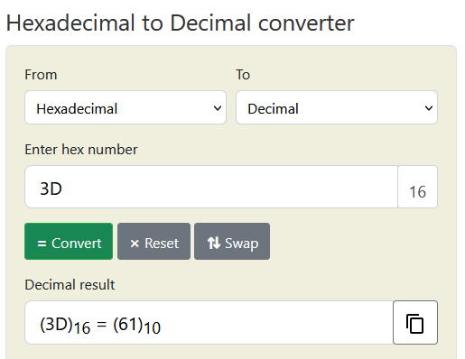
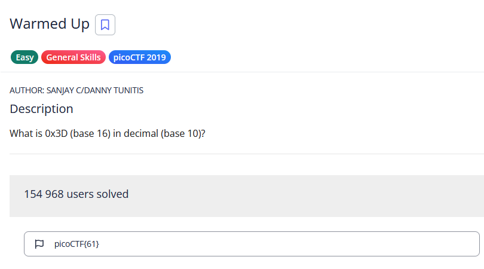

# Challenge: Warmed Up
**Category:** General Skills | **Difficulty:** Easy | **Author:** Sanjay C/Danny Tunitis

## Challenge Description
*"What is 0x3D (base 16) in decimal (base 10)?"*

This challenge focuses on basic number system conversion, specifically translating a hexadecimal (base 16) value into a decimal (base 10) integer.

---

## Analysis
In computing, hexadecimal is often used as a more human-readable way to represent binary data. The prefix `0x` is a standard convention indicating that the following characters are in hexadecimal. 

The goal here is a straight conversion:
* **Hexadecimal (Base 16):** Uses digits 0-9 and letters A-F.
* **Decimal (Base 10):** Our standard counting system.

---

## Solution

### Step 1: Conversion
I used an online hexadecimal-to-decimal converter to quickly translate the value. Entering `3D` yielded the decimal result of `61`.

  
  
<i>Figure 1: Using a converter to translate the hex value 0x3D to decimal 61.</i>

### Step 2: Flag Formatting
As per the standard picoCTF rules, the resulting decimal number was wrapped in the flag format: `picoCTF{61}`.

  
  
<i>Figure 2: Successful submission of the converted value.</i>

---

## 🚩 Final Flag

  
Click to reveal the flag

  
  `picoCTF{61}`

---

## Key Takeaways
* **Number Bases:** Understanding the difference between Base 16 (Hex) and Base 10 (Decimal).
* **Tool Efficiency:** Using quick conversion tools for standard tasks allows focusing on more complex parts of a CTF.
