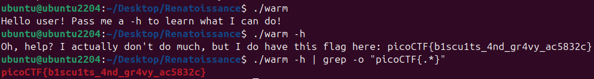

# 🔮 Challenge: Wave a flag
**Category:** General Skills | **Difficulty:** Easy | **Author:** syreal

## 📝 Challenge Description
*"Can you invoke help flags for a tool or binary? This program has extraordinarily helpful information... binary: warm"*

This challenge focuses on interacting with binaries using CLI arguments and discovery flags to reveal hidden functionality or information.

---

## 🔍 Analysis
The provided file `warm` is a compiled Linux binary. Executing it without arguments results in a prompt suggesting the use of a help flag.

<div align="center">
  
  <p><i>Figure 1: Executing the binary without arguments prompts the user to use '-h' for help.</i></p>
</div>

The program explicitly states: *"Pass me a -h to learn what I can do!"*.

---

## 🛠️ Solution

### Step 1: Execution with the Help Flag
Following the hint, I executed the binary with the `-h` flag. This triggered a different logic branch in the program, revealing the flag.

```bash
./warm -h
```

### Step 2: Advanced Extraction (Piping)
To demonstrate efficient data extraction, I combined the execution with a pipe to `grep`. This isolates the flag from the rest of the output.

```bash
./warm -h | grep -o "picoCTF{.*}"
```
* **`|` (Pipe)**: Redirects the output of the binary to the next command.
* **`grep -o`**: Extracts only the part of the string that matches the pattern.

<div align="center">
  
  <p><i>Figure 2: Successfully isolating the flag using grep.</i></p>
</div>

---

## 🚩 Final Flag
<details>
  <summary>Click to reveal the flag</summary>
  
  `picoCTF{b1scu1ts_4nd_gr4vy_ac5832c}`
</details>

---

## 💡 Key Takeaways
* **CLI Discovery:** Help flags (`-h`, `--help`) are the first line of reconnaissance when analyzing unknown binaries.
* **Data Piping:** Using pipes with `grep` is a powerful way to automate the extraction of sensitive information like flags or keys.
* **Executable Context:** Programs often contain hidden messages that are only accessible through specific command-line arguments.
