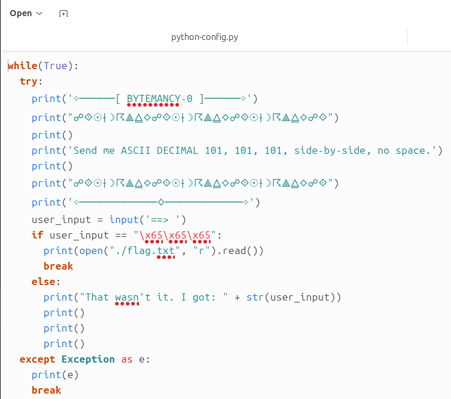
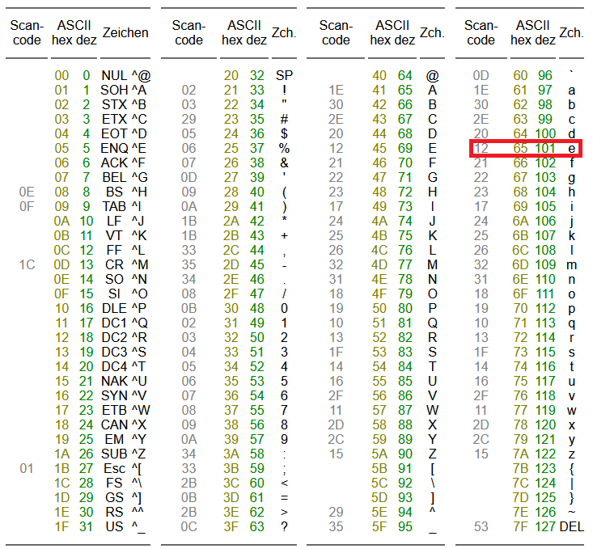
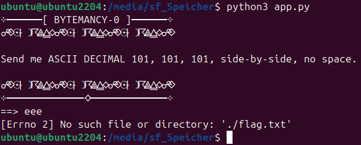
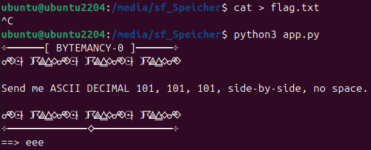
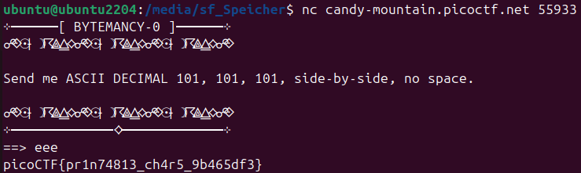

# Challenge: Bytemancy 0
**Category:** General Skills | **Difficulty:** Easy | **Author:** LT 'syreal' Jones

## Challenge Description
*"Can you conjure the right bytes? The program's source code can be downloaded here. Connect to the program with netcat."*

This challenge is a perfect entry point into understanding how data is represented in different formats (Decimal, Hex, ASCII) and how network-hosted services work.

> **Note:** This challenge uses **dynamic instances**. You must start the instance on the PicoCTF platform to receive your unique `nc` (netcat) connection string.

---

## Step-by-Step Analysis

### Phase 1: Code Review (The Blueprint)
I started by downloading and inspecting the Python source code in my VirtualBox Ubuntu environment. The program was designed to act as a gatekeeper. 

In `bytemancy_0_1.png`, you can see the core logic:
* The program explicitly asks for **ASCII DECIMAL 101, 101, 101**.
* Under the hood, it compares the input to the byte string `\x65\x65\x65`.

  
  
<i>Figure 1: Inspecting the Python logic and the ASCII prompt.</i>

### Phase 2: Deciphering the Bytes
To provide the "right bytes", I needed to translate the decimal value `101` into a character. I used an ASCII reference table.

As shown in `bytemancy_0_2.png`:
* **Decimal 101** = Character **'e'**.
* **Hexadecimal 0x65** = Character **'e'**.
* **Result:** The "conjured bytes" are simply `eee`.

  
  
<i>Figure 2: Using the ASCII table to map Decimal 101 to the letter 'e'.</i>

### Phase 3: Local Environment & The "Missing Flag"
I installed Python on my Linux VM to test the script locally. When I provided the correct input `eee`, the script worked—but it crashed immediately because my local machine didn't have a `flag.txt` file.

  
  
<i>Figure 3: Running the script locally results in a 'File Not Found' error for the flag.</i>

### Phase 4: Creative "Mocking" (The Cheese Attempt)
To see if I could "fake" the success state, I created an empty `flag.txt` file in the same directory. I ran the script again, entered `eee`, and... nothing happened. The script read the file, but since the file was empty, it didn't print anything. 

**Lesson learned:** You can simulate the environment, but you can't conjure the secret data that only exists on the PicoCTF server!

  
  
<i>Figure 4: Creating a dummy flag file—valuable for debugging, but no points here.</i>

---

## The Solution: Remote Execution

### Using Netcat (nc)
Finally, I launched the instance and used `netcat` to connect to the actual challenge server. Netcat is a powerful networking utility used to read from and write to network connections.

**Command:** `nc candy-mountain.picoctf.net 55933`

1.  The server asked for the bytes.
2.  I sent `eee`.
3.  The server's internal `flag.txt` was read and transmitted back to my terminal.

  
  
<i>Figure 5: Successful remote connection and flag capture.</i>

---

## 🚩 Final Flag

  
Click to reveal the flag

  
  `picoCTF{pr1n74813_ch4r5_9b465df3}`

---

## Key Takeaways
* **Data Representation:** ASCII values are just numbers that computers interpret as characters. Decimal 101, Hex 0x65, and 'e' are the same thing.
* **Local vs. Remote:** A script is just a tool; the data (the flag) is the prize stored on the server.
* **Netcat Mastery:** Learned how to interact with remote services directly via TCP/IP.
