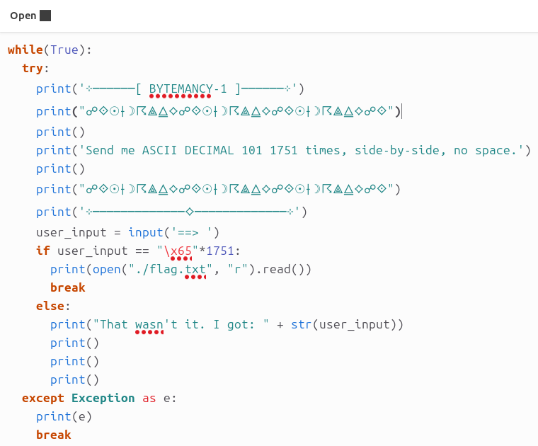
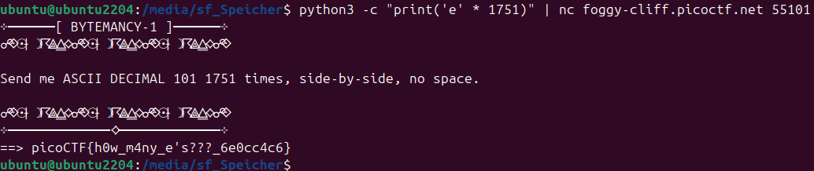

# Challenge: Bytemancy 1
**Category:** General Skills | **Difficulty:** Easy | **Author:** LT 'syreal' Jones | **Environment:** Ubuntu 22.04 (VirtualBox)

## Challenge Description
*"Can you conjure the right bytes? Connect to the program with netcat."*

This challenge is the direct evolution of Bytemancy 0. While the logic remains the same, the scale changes drastically, forcing the transition from manual input to automation.

> **Note:** This challenge uses **dynamic instances**. Each session provides a unique host and port for the `nc` connection.

---

## Analysis

### 1. The Scaling Problem
Looking at the source code in **bytemancy_1_1.png**, the requirement is clear: the program wants the ASCII character for decimal 101.

As established in the ASCII table in **bytemancy_1_2.png**:
* **Decimal 101 = 'e'** (Hex: `\x65`).

However, there is a catch: The program doesn't just want three 'e's. It asks for a massive, absurd amount of them: **1751 times**. Typing this manually in my **Ubuntu VM** would not only be prone to error but physically impossible within the instance's time limit.

  
  
<i>Figure 1: The source code reveals the ASCII logic at a much higher frequency.</i>

  
  
<i>Figure 2: ASCII table confirming that Decimal 101 is the letter 'e'.</i>

### 2. Strategic Research & Automation
I realized that I needed a way to "pipe" a large amount of data directly into the network connection. This is where the power of the **Linux CLI (Ubuntu)** and Python come in. 

Instead of opening `nc` and typing manually, I used a **Python One-Liner** to generate the input and feed it directly into the connection via a Pipe.

---

## The Solution: Piping & Automation

The breakthrough command executed in the **Ubuntu terminal** was:
`python3 -c "print('e' * 1751)" | nc foggy-cliff.picoctf.net 55101`

### Breakdown of the Command:
* **`python3 -c "print('e' * 1751)"`**: This tells Python to execute a command (`-c`) that prints the character 'e' exactly 1751 times.
* **`|` (The Pipe)**: This is a core Linux concept used in my Ubuntu environment. It takes the **Standard Output (stdout)** of the Python command and redirects it as **Standard Input (stdin)** into the next command.
* **`nc ...`**: Netcat receives the 1751 'e's instantly as if I had typed them at lightning speed.

  
  
<i>Figure 3: Using Python to automate the input and capturing the flag in Ubuntu.</i>

---

## 🚩 Final Flag
The server accepted the automated flood of bytes and returned the flag:

`picoCTF{h0w_m4ny_e's???_6e0cc4c6}`

---

## Key Takeaways
* **Automation is Key:** In cybersecurity, if a task is repetitive and absurdly large, it's a hint to automate it.
* **The Power of Pipes:** Mastered the `|` operator in Linux to chain processes together.
* **Ubuntu/VirtualBox Advantage:** Using a native Linux terminal allowed for seamless piping and tool access (nc/python3) which is more efficient than manual Windows input.
