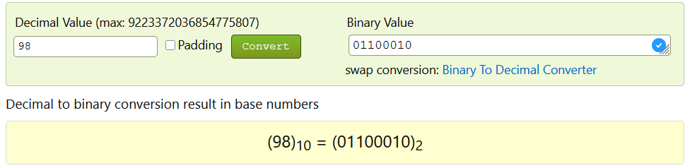
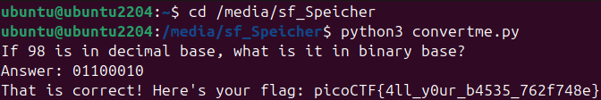

# 🚩 Challenge: convertme.py
**Category:** General Skills | **Difficulty:** Easy | **Author:** LT 'syreal' Jones

## 📝 Challenge Description
"Run the Python script and convert the given number from decimal to binary to get the flag."

This challenge tests basic knowledge of numeral systems, specifically converting a base-10 (decimal) number into a base-2 (binary) representation.

## 🔍 Analysis & Solution
The provided file is a Python script that acts as an interactive quiz. When executed, it generates a random decimal number and asks the user to input its binary equivalent. 

### Step 1: Executing the Script
Running the script in the Linux terminal presented the following prompt:
`If 98 is in decimal base, what is it in binary base?`

### Step 2: Number Conversion
To solve this quickly, I used an online decimal-to-binary converter. I inputted the decimal value `98` and retrieved the binary output: `01100010`.

*Figure 1: Using an online tool to quickly convert the decimal value 98 into binary.*

### Step 3: Getting the Flag
I entered the binary string `01100010` back into the terminal prompt. The script verified the answer and outputted the flag.

*Figure 2: Providing the correct binary answer to the script successfully reveals the flag.*

## 🚩 Final Flag

  
Click to reveal the flag

  `picoCTF{4ll_y0ur_b4535_762f748e}`

## 💡 Key Takeaways
* **Numeral Systems:** Understanding how decimal, binary, and hexadecimal systems work is a core requirement for computer science and reverse engineering.
* **Tooling:** While doing manual conversions is a good exercise, utilizing online converters or local CLI tools is the standard, efficient approach during practical security tasks.
