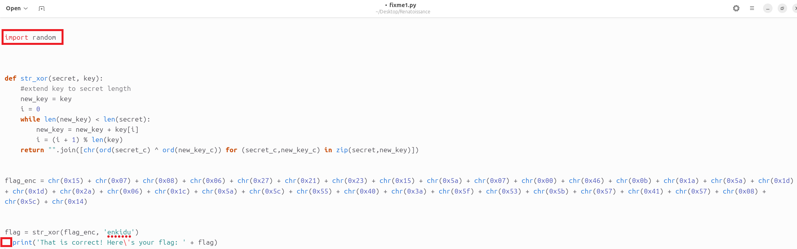
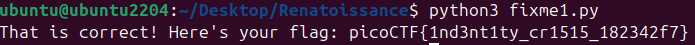

# 🚩 Challenge: fixme1.py
**Category:** General Skills | **Difficulty:** Easy | **Author:** LT 'syreal' Jones

## 📝 Challenge Description
*"Fix the syntax error in this Python script to print the flag."*

This challenge introduces fundamental Python syntax rules, specifically focusing on how Python handles code blocks and whitespace formatting.

---

## 🔍 Analysis
The provided file is a Python script designed to decrypt a string using a basic XOR operation. However, attempting to run it immediately throws an `IndentationError`. 

Looking at the source code in the editor, two anomalies stand out:
1. **Unused Import:** There is an `import random` statement at the top of the script. While this is technically inefficient, it does not cause a syntax error.
2. **Indentation Error:** The final `print(...)` statement contains leading spaces. In Python, indentation is used to define code blocks (such as those within loops or functions). Since this print statement is in the global scope and not part of any block, it must be completely flush with the left margin.

<div align="center">
  
  <p><i>Figure 1: The code editor reveals leading spaces before the final print statement, breaking Python's strict indentation rules. It also highlights an unused random import.</i></p>
</div>

---

## 🛠️ Solution

### Step 1: Fixing the Syntax
I opened the `fixme1.py` file in a text editor and deleted the extraneous spaces at the beginning of the last line. 

### Step 2: Execution
With the indentation corrected, I executed the script via the terminal using the Python 3 interpreter:

```bash
python3 fixme1.py
```

The script ran flawlessly, performed the XOR decryption, and printed the flag to standard output.

<div align="center">
  
  <p><i>Figure 1: Executing the corrected Python script successfully reveals the flag.</i></p>
</div>

---

## 🚩 Final Flag
<details>
  <summary>Click to reveal the flag</summary>
  
  `picoCTF{1nd3nt1ty_cr1515_182342f7}`
</details>

---

## 💡 Key Takeaways
* **Strict Whitespace:** Unlike languages that use curly braces `{}`, Python relies entirely on indentation to interpret program structure.
* **Debugging Basics:** Recognizing and resolving an `IndentationError` is one of the first and most critical skills when reverse-engineering or patching Python scripts.
