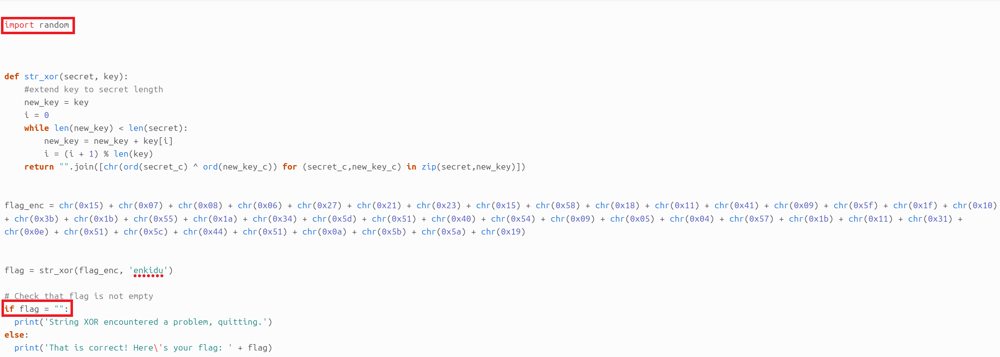
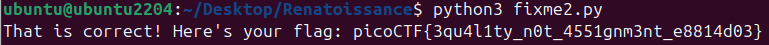

# 🚩 Challenge: fixme2.py
**Category:** General Skills | **Difficulty:** Easy | **Author:** LT 'syreal' Jones

## 📝 Challenge Description
*"Fix the syntax error in the Python script to print the flag."*

This challenge focuses on a very common logical syntax error in programming: confusing the assignment operator with the equality operator.

---

## 🔍 Analysis
The provided file is a Python script that decrypts a string using a basic XOR operation. However, attempting to run it immediately throws a `SyntaxError: invalid syntax`. 

Looking at the source code in the editor, the issue is located in the `if` statement at the bottom of the script:

<div align="center">
  
  <p><i>Figure 1: The code editor reveals the use of a single equals sign '=' (assignment) inside the if-condition instead of the double equals sign '==' (equality check).</i></p>
</div>

In Python, `if flag = "":` is invalid because you cannot assign a variable inside a basic conditional evaluation. It must be an equality check.

---

## 🛠️ Solution

### Step 1: Fixing the Logic Error
I opened the `fixme2.py` file and changed the assignment operator (`=`) to the equality operator (`==`).

**Before:**
```python
if flag = "":
```

**After:**
```python
if flag == "":
```

### Step 2: Execution
With the syntax corrected, I executed the script via the terminal using the Python 3 interpreter:

```bash
python3 fixme2.py
```

<div align="center">
  
  <p><i>Figure 2: Executing the corrected Python script successfully bypasses the syntax error and reveals the flag.</i></p>
</div>

---

## 🚩 Final Flag
<details>
  <summary>Click to reveal the flag</summary>
  
  `picoCTF{3qu4l1ty_n0t_4551gnm3nt_e8814d03}`
</details>

---

## 💡 Key Takeaways
* **Operator Distinction:** Understanding the critical difference between `=` (Assignment) and `==` (Equality check).
* **Syntax Debugging:** Python error tracebacks clearly point to the line where syntax rules are violated, making it easy to spot logical typos like this.
