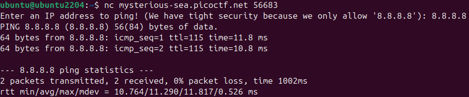
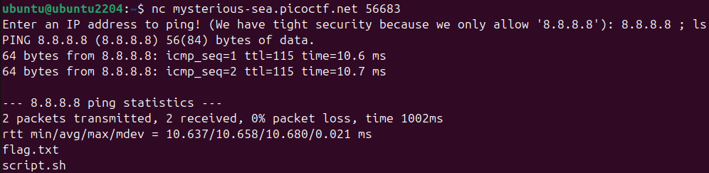
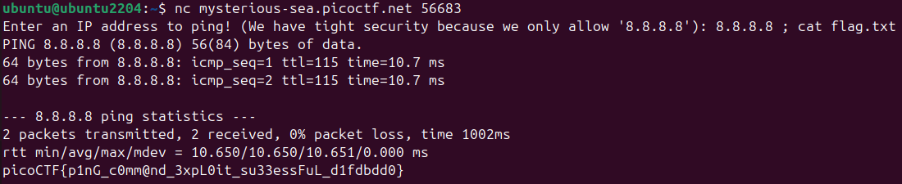

# 🔮 Challenge: ping-cmd
**Category:** General | **Difficulty:** Easy | **Author:** Yahaya Meddy | **Environment:** Ubuntu 22.04 (VirtualBox)

## 📝 Challenge Description
The server offers a service to ping an IP address (specifically Google's `8.8.8.8`). The goal is to bypass the intended functionality and trick the server into revealing hidden files.

> **Note:** This challenge uses **dynamic instances**. You must launch your own challenge instance on the picoCTF platform to get the specific host URL and port for your `nc` (Netcat) connection.

---

## 🔍 Step-by-Step Analysis

### 1. Initial Testing (Sanity Check)
In the first step, I performed a standard ping to verify the service's behavior and ensure the connection via Netcat was stable.

  
  
<i>Figure 1: Standard ping test to verify server behavior. Standard input yields no hidden information.</i>

### 2. Exploiting Command Injection (Listing Files)
Knowing that the server likely uses a shell to execute the ping, I used the semicolon (`;`) operator. In Linux, the semicolon acts as a command separator, allowing multiple commands to run sequentially.

* **Command used:** `8.8.8.8 ; ls`
* **Technical Explanation:** The server executes: `ping 8.8.8.8 ; ls`. 
    The shell finishes the `ping` and immediately starts the `ls` command.
* **Discovery:** The output revealed two interesting files: `script.sh` and, more importantly, **`flag.txt`**.

  
  
<i>Figure 2: Using the semicolon operator to inject the 'ls' command and discover hidden files.</i>

### 3. Capturing the Flag
Now that the filename was known, I replaced the `ls` command with `cat` to read the contents of the flag file.

* **Command used:** `8.8.8.8 ; cat flag.txt`
* **Result:** The server printed the flag directly into the terminal output.

  
  
<i>Figure 3: Injecting the 'cat' command to read and exfiltrate the flag.</i>

---

## 🚩 Final Flag

  
Click to reveal the flag

  
  `picoCTF{p1nG_c0mm@nd_3xpL0it_su33essFuL_d1fdbdd0}`

---

## 💡 Technical Deep Dive: Why did this work?
This attack is called **Command Injection**. It happens when an application passes unsafe user-supplied data (in this case, the IP string) directly to a system shell without proper sanitization. 

1.  **Vulnerable Code Logic:** The backend server likely executes a system call similar to: 
    `system("ping -c 2 " + user_input);`
2.  **Input Manipulation:** By entering `; cat flag.txt`, we maliciously alter the execution logic to:
    `system("ping -c 2 8.8.8.8 ; cat flag.txt");`
3.  **Shell Execution:** The OS interprets this as two separate, valid instructions and executes both with the privileges of the server application.

### Environment & Tools
* **OS:** Ubuntu 22.04 LTS (VirtualBox).
* **Tool:** `nc` (Netcat) for network communication.
* **Advantage:** Performing this in a local Linux VM allows for immediate testing of command syntax (like `;`, `&&`, or `||`) before sending the payload to the target.
