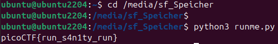

# 🚩 Challenge: runme.py
**Category:** General Skills | **Difficulty:** Easy | **Author:** Sujeet Kumar

## 📝 Challenge Description
"Run the runme.py script to get the flag. Download the script with your browser or with wget in the webshell."

This challenge acts as a basic "sanity check" to ensure the user knows how to execute a Python script from the Linux command line.

## 🔍 Analysis & Solution
The provided file is a simple Python script (`runme.py`). There is no reverse engineering or debugging required. The goal is strictly to execute the file in a standard Python environment.

### Execution Step
I opened my Linux terminal, navigated to the directory containing the downloaded script, and executed it using the Python 3 interpreter:

```bash
python3 runme.py
```

The script ran successfully and immediately printed the flag to the standard output.


*Figure 1: Executing the script via the Linux CLI.*

## 🚩 Final Flag
<details>
  <summary>Click to reveal the flag</summary>

  `picoCTF{run_s4n1ty_run}`
</details>

## 💡 Key Takeaways
* **CLI Basics:** Executing scripts directly from the command line using `python3 <filename>` is a fundamental skill for any cybersecurity task.
* **Sanity Checks:** Often, CTFs include easy challenges like this to verify that the participant's local environment (like Python installations) is working correctly.
