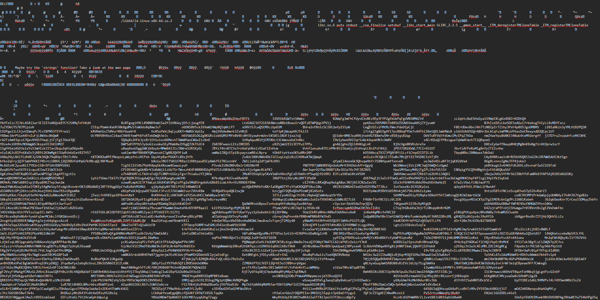
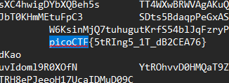
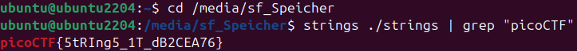

# Challenge: strings it
**Category:** General Skills | **Difficulty:** Easy | **Author:** Sanjay C/Danny Tunitis

## Challenge Description
*"Can you find the flag in file without running it?"*

This challenge introduces a fundamental concept in digital forensics and reverse engineering: static analysis. Before executing an unknown (and potentially malicious) binary, one should always extract its human-readable strings to find hardcoded credentials, URLs, or in this case, the flag.

---

## Analysis & Solutions

The challenge provides a file simply named `strings` and explicitly forbids running it. When dealing with compiled binaries, opening them directly usually results in a garbled mess of binary data, but the printable characters remain intact. 

I solved this using two different approaches to demonstrate both GUI pragmatism and CLI mastery.

### Approach 1: The Pragmatic GUI Way (Text Editor & Ctrl+F)
Sometimes, the simplest method works. I forced a standard text editor to open the raw binary file. As expected, it rendered a massive wall of unreadable characters and random text snippets.

<div align="center">
  
  <p><i>Figure 1: Opening the raw binary in a text editor reveals a chaotic mix of encoded data and readable strings.</i></p>
</div>

Since every flag in this CTF starts with the standard format, I simply used the `Ctrl+F` search function to look for the keyword `picoCTF`. The text editor jumped straight through the garbage data to the hidden flag.

<div align="center">
  
  <p><i>Figure 2: Using the find function (Ctrl+F) to easily locate the flag format.</i></p>
</div>

### Approach 2: The "Hacker" CLI Way (Intended Solution)
While the text editor trick works for smaller files, the challenge name *"strings it"* is actually a massive hint to use the Linux native `strings` command. 

The `strings` utility extracts only the printable character sequences from a binary file. By piping (`|`) the output directly into `grep` (the Linux search tool), we can filter the massive output down to the exact line we need. Because the downloaded file is also named `strings`, we use `./strings` to specify the file path.

```bash
strings ./strings | grep "picoCTF"
```

<div align="center">
  
  <p><i>Figure 3: Executing the strings command and piping it into grep to instantly isolate the flag.</i></p>
</div>

---

## 🚩 Final Flag

<details>
  <summary>Click to reveal the flag</summary>
  
  `picoCTF{5tRIng5_1T_dB2CEA76}`
</details>

---

## Key Takeaways
* **Static Analysis:** Never run unknown binaries immediately. Always inspect their contents first.
* **The `strings` Utility:** The most efficient way to extract human-readable text from non-text files in Linux.
* **Command Piping:** Combining `strings` with `grep` is a mandatory skill for quickly searching through massive amounts of data in CTF challenges.
