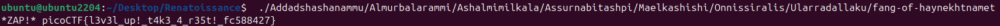

# 🚩 Challenge: Tab, Tab, Attack
**Category:** General Skills | **Difficulty:** Easy | **Author:** syreal

## 📝 Challenge Description
*"Using tabcomplete in the Terminal will add years to your life, esp. when dealing with long rambling directory structures and filenames. Addadshashanammu.zip"*

This challenge introduces a massive quality-of-life feature in Unix-like command-line interfaces: **Tab Completion**.

---

## 🔍 Analysis
The challenge provides a compressed file named `Addadshashanammu.zip`. When decompressed, it extracts a deeply nested directory structure with incredibly long, randomly generated folder names. 

Manually typing the path to reach the final file would be tedious and prone to typos. The intended mechanic is to use the `Tab` key to auto-complete the directory names.

---

## 🛠️ Solution

### Step 1: Extract the Archive
First, I unzipped the provided archive using the standard Linux utility:
```bash
unzip Addadshashanammu.zip
```

### Step 2: Utilizing Tab Completion
Instead of typing the full path to navigate through the folders or execute the hidden binary, I simply typed `./` followed by the first few letters of the root directory and pressed the `Tab` key repeatedly. The shell automatically filled in the rest of the ridiculously long names.

### Step 3: Execution
Once the path was fully auto-completed via Tab spamming, pressing `Enter` executed the final binary (`fang-of-haynekhtnamet`) located at the deepest level of the directory tree. The binary immediately output the flag.

<div align="center">
  
  <p><i>Figure 1: Executing the deeply nested binary instantly after auto-completing the path.</i></p>
</div>

---

## 🚩 Final Flag
<details>
  <summary>Click to reveal the flag</summary>
  
  `picoCTF{l3v3l_up!_t4k3_4_r35t!_fc588427}`
</details>

---

## 💡 Key Takeaways
* **Efficiency:** Tab completion is arguably the most used shortcut in Linux environments, saving time and preventing syntax errors.
* **Archive Handling:** Using `unzip` to extract standard `.zip` archives directly from the CLI.
* **Path Traversal:** Executing a binary nested deep within a directory structure using a relative path (`./`).
