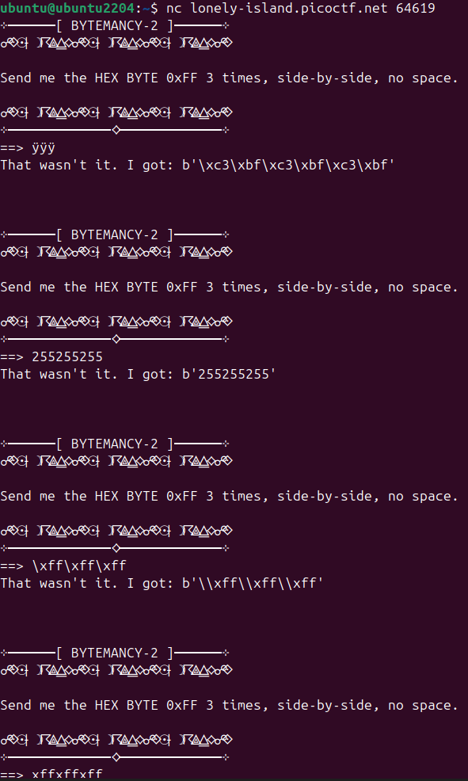
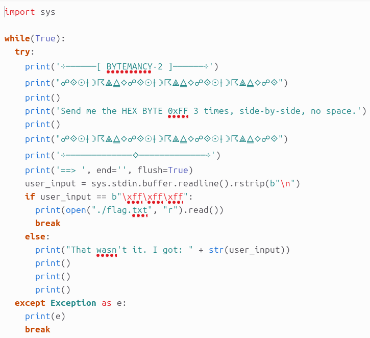
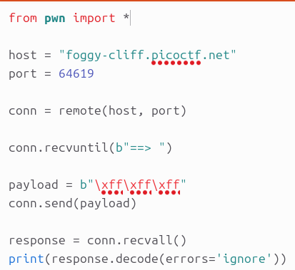
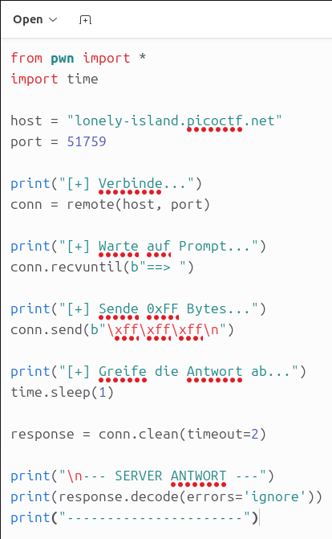
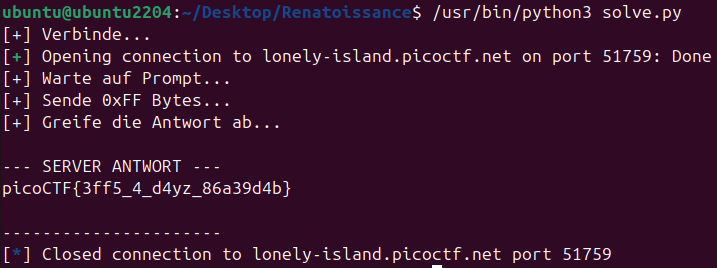

# 🔮 Challenge: Bytemancy 2
**Category:** General Skills | **Difficulty:** Medium | **Author:** LT 'syreal' Jones

## 📝 Challenge Description
*"Can you conjure the right bytes? The program's source code can be downloaded here. Additional details will be available after launching your challenge instance."*

> **Note:** This challenge uses **dynamic instances**. You must launch your own instance to get the specific host URL and port. The solution scripts must be updated accordingly.

---

## 🛑 The Struggle: An Honest Analysis
This challenge was a rollercoaster. It perfectly demonstrated that sometimes the biggest hurdles in a CTF aren't the challenges themselves, but the environment and misunderstandings of how terminal inputs work.

### Fail 1: The Keyboard Illusion
The server prompt asked to send the *HEX BYTE 0xFF 3 times, side-by-side, no space*. Naturally, my first instinct was to just connect via `nc` and type it in. 

As seen in **Figure 1**, I tried everything: holding ALT+255 to type `ÿÿÿ`, typing `255255255`, and literally typing out `\xff\xff\xff`. The server rejected all of it. Why? Because typing `\xff` on a keyboard sends the literal ASCII characters `\`, `x`, `f`, `f`, not the raw byte value `255` (`0xFF`).

  
  
<i>Figure 1: Wildly misunderstanding how raw bytes work over standard terminal input.</i>

### The Revelation: Reading the Source Code
I finally looked at the provided source code (`bytemancy_2_0.png`), and everything clicked:

  
  
<i>Figure 2: The server source code revealing the exact required payload and the hidden newline requirement.</i>

The critical line was: `user_input = sys.stdin.buffer.readline().rstrip(b"\n")`.
The server was waiting for a full line (ending with an Enter/Newline `\n`), stripping the newline, and comparing the raw bytes against `b"\xff\xff\xff"`. I needed to send *raw bytes*, meaning I had to write a Python script using `pwntools`. Even the official challenge hints confirmed this by stating: *"There's no way to print these bytes"* and *"Use pwntools to send raw bytes over the network"*.

### Fail 2: The Infinite Hang (`recvall`)
I drafted my first `pwntools` script (**Figure 3**). It sent the payload, but then it just hung forever. 

  
  
<i>Figure 3: Using conn.recvall() caused the script to hang indefinitely.</i>

**The issue:** I used `conn.recvall()`. Because the server's source code runs in a `while(True):` loop, it *never* closes the connection. `recvall()` waits for the connection to close, causing an infinite deadlock. I had to manually kill it with `CTRL+C`.

### Fail 3: Environment & Dependency Hell
Before I could even fix the script, my local Ubuntu VirtualBox environment completely melted down:
1. **The Shared Folder Bug:** I was editing my script inside a Windows/Ubuntu shared folder (`/media/sf_Speicher`). When saving with Gedit, VirtualBox's file permissions crashed, creating garbage `.goutputstream` files and refusing to update my actual Python file. *Fix: Moved the workspace to the native `~/Desktop`.*
2. **The Two-Python War:** I had manually installed Python 3.14.3, which hijacked the `python3` command. However, `apt` had installed `pwntools` for the system's default Python (Ubuntu 24.04). Calling `python3 solve.py` resulted in `ModuleNotFoundError: No module named 'pwn'`. 
*Fix: Bypassed my custom install by explicitly calling the system Python via `/usr/bin/python3 solve.py`.*

---

## 🛠️ The Final Solution

After surviving environment hell, I wrote the final, bulletproof script. Instead of `recvall()`, I used `conn.clean(timeout=2)` to simply flush whatever the server spit out after 1 second of waiting. 

*(Note: The full script is available in the `/solution` directory of this repository. Remember to adapt the `host` and `port` to your instance!)*

  
  
<i>Figure 4: The final, working Python script using clean() and explicit byte/newline sending.</i>

Executing this script bypassed all terminal input limitations, satisfied the server's `readline()` requirement, and grabbed the flag from the buffer instantly.

  
  
<i>Figure 5: Bypassing the input restrictions and capturing the flag.</i>

---

## 🚩 Final Flag

  
Click to reveal the flag

  
  `picoCTF{3ff5_4_d4yz_86a39d4b}`

---

## 💡 Key Takeaways
* **Raw Network I/O:** Standard terminal keyboards cannot send raw unprintable bytes. `pwntools` is essential for interacting with raw socket streams.
* **Read the Source:** Analyzing `sys.stdin.buffer.readline().rstrip(b"\n")` revealed that a newline (`\n`) was strictly required to bypass the blocking read.
* **Buffer Management:** Never use `recvall()` against a server running an infinite `while(True)` loop. Use `time.sleep()` and `conn.clean()` to pull data from a persistently open connection.
* **Environment Sanity:** Don't write code directly in VirtualBox Shared Folders if using atomic-save editors (like Gedit). Know which Python binary your terminal is actually executing!
